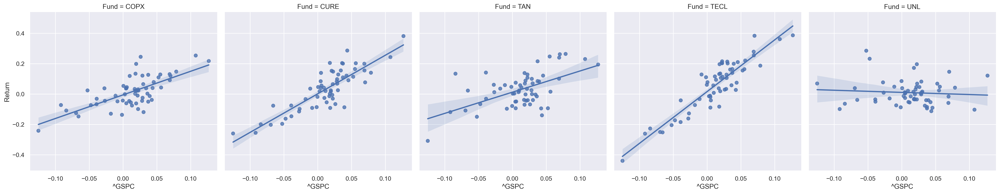

# Term Project: FIN6525

by [Daniel Cárdenas [6102358]](https://danielcs88.github.io/)

 - [Term Project: Fin6525](#Term-Project:-Fin6525)
   * [Part One: Data](#Part-One:-Data)
     + [A. Table 1](#A.-Table-1)
       - [Table 1: Monthly Returns](#Table-1:-Monthly-Returns)
       - [Table 1: Summary Statistics](#Table-1:-Summary-Statistics)
       - [Annualized Returns](#Annualized-Returns)
     + [B. Table 2: Covariance Matrix](#B.-Table-2:-Covariance-Matrix)
     + [C. Table 3: Correlation Matrix](#C.-Table-3:-Correlation-Matrix)
     + [D. Prospectus Strategy](#D.-Prospectus-Strategy)
   * [Part Two](#Part-Two)
     + [A. CAPM](#A.-CAPM)
     + [B. β](#B.-β)
     + [C. Table 4](#C.-Table-4)
     + [D. Essay: Differences Between Dow Jones And S&P 500](#D.-Essay:-Differences-between-Dow-Jones-and-S&P-500)
     + [E. Runs Test: S&P 500](#E.-Runs-Test:-S&P-500)
       - [Runs Test Interpretation](#Runs-Test-Interpretation)
   * [Part Three](#Part-Three)
       - [A. Table 5](#A.-Table-5)
     + [B. Graph 1](#B.-Graph-1)
       - [Static Graph](#Static-Graph)
       - [Dynamic Graph](#Dynamic-Graph)
   * [Part Four](#Part-Four)
     + [A. Graph 2: Mean Variance Plot](#A.-Graph-2:-Mean-Variance-Plot)
       - [Globally Minimum Variance Portfolio](#Globally-Minimum-Variance-Portfolio)
     + [B. Graph 3: Mean-Variance Frontier](#B.-Graph-3:-Mean-Variance-Frontier)
       - [Random Portfolios](#Random-Portfolios)
         * [Minimum Volatility](#Minimum-Volatility)
         * [Maximum Sharpe Ratio](#Maximum-Sharpe-Ratio)
   * [Part Five: Performance](#Part-Five:-Performance)
     + [Sharpe Measure](#Sharpe-Measure)
     + [Treynor Measure](#Treynor-Measure)
     + [Rankings](#Rankings)
       - [Sharpe Measure](#Sharpe-Measure:-Rankings)
       - [Treynor Measure](#Treynor-Measure:-Rankings)
       - [Geometric Mean](#Geometric-Mean:-Rankings)


```python
from IPython import get_ipython

# This whole line is just to make running the code possible using Google Colab
# and installs depdenencies

if "google.colab" in str(get_ipython()):
    print("Running on Colab")
    get_ipython().run_cell_magic(
        "capture",
        "",
        "! pip install yfinance\n! pip install numpy-financial\n! pip install pandas-bokeh\n! pip3 install pickle5",
    )
    import pickle5 as pickle


else:
    print("Not running on Colab")
```

    Not running on Colab


```python
import functools
import operator
from datetime import datetime
from typing import List

import matplotlib.pyplot as plt
import matplotlib.ticker as mtick
import numpy as np
import numpy_financial as npf
import pandas as pd
import pandas_bokeh
import seaborn as sns
import statsmodels.api as sm
import statsmodels.sandbox.stats.runs as runs
import yfinance as yf
from IPython.display import Markdown, display
from matplotlib.dates import date2num
from pandas_datareader import data as pdr
from scipy.stats import gmean

# Plotting parameters to make plots bigger
plt.rcParams["figure.dpi"] = 125
get_ipython().run_line_magic("config", "InlineBackend.figure_format = 'retina'")
```


```python
# Formatting to display numbers
PERCENT = "{:,.3%}"
CURRENCY = "${:,.2f}"

proper_format = {
    "Arithmetic Mean": PERCENT,
    "Geometric Mean": PERCENT,
    "Standard Deviation": PERCENT,
    "Current Value: $10k": CURRENCY,
}

plt.style.use("seaborn-white")
```


```python
# pylint: disable=W0105,W0104
```


```python
start = datetime(2017, 1, 1)
end = datetime(2022, 1, 1)
```

 ## Part One: Data


```python
funds = sorted(["COPX", "UNL", "CURE", "TAN", "TECL"])
```


```python
tickers = yf.Tickers(funds)
```


```python
# Price Data
data = yf.download(funds, start=start, end=end, interval="1mo")[
    "Adj Close"
].dropna()  # Dropping non-trading dates
```

    [*********************100%***********************]  5 of 5 completed


```python
data.head()
```


<div>
<style scoped>
    .dataframe tbody tr th:only-of-type {
        vertical-align: middle;
    }

    .dataframe tbody tr th {
        vertical-align: top;
    }

    .dataframe thead th {
        text-align: right;
    }
</style>
<table border="1" class="dataframe">
  <thead>
    <tr style="text-align: right;">
      <th></th>
      <th>COPX</th>
      <th>CURE</th>
      <th>TAN</th>
      <th>TECL</th>
      <th>UNL</th>
    </tr>
    <tr>
      <th>Date</th>
      <th></th>
      <th></th>
      <th></th>
      <th></th>
      <th></th>
    </tr>
  </thead>
  <tbody>
    <tr>
      <th>2017-01-01</th>
      <td>22.686363</td>
      <td>28.715219</td>
      <td>16.800987</td>
      <td>5.435126</td>
      <td>10.80</td>
    </tr>
    <tr>
      <th>2017-02-01</th>
      <td>21.537806</td>
      <td>34.466110</td>
      <td>18.229412</td>
      <td>6.194886</td>
      <td>9.78</td>
    </tr>
    <tr>
      <th>2017-03-01</th>
      <td>20.609764</td>
      <td>33.828220</td>
      <td>16.791271</td>
      <td>6.571821</td>
      <td>10.61</td>
    </tr>
    <tr>
      <th>2017-04-01</th>
      <td>19.654165</td>
      <td>35.261028</td>
      <td>17.005049</td>
      <td>6.945811</td>
      <td>10.84</td>
    </tr>
    <tr>
      <th>2017-05-01</th>
      <td>18.569923</td>
      <td>35.938179</td>
      <td>17.986481</td>
      <td>7.749743</td>
      <td>10.24</td>
    </tr>
  </tbody>
</table>
</div>


```python
# To calculate simple returns we simply call the percent change function
returns = data.pct_change()
```


```python
returns.tail()
```


<div>
<style scoped>
    .dataframe tbody tr th:only-of-type {
        vertical-align: middle;
    }

    .dataframe tbody tr th {
        vertical-align: top;
    }

    .dataframe thead th {
        text-align: right;
    }
</style>
<table border="1" class="dataframe">
  <thead>
    <tr style="text-align: right;">
      <th></th>
      <th>COPX</th>
      <th>CURE</th>
      <th>TAN</th>
      <th>TECL</th>
      <th>UNL</th>
    </tr>
    <tr>
      <th>Date</th>
      <th></th>
      <th></th>
      <th></th>
      <th></th>
      <th></th>
    </tr>
  </thead>
  <tbody>
    <tr>
      <th>2021-09-01</th>
      <td>-0.073673</td>
      <td>-0.162274</td>
      <td>-0.066332</td>
      <td>-0.172776</td>
      <td>0.232795</td>
    </tr>
    <tr>
      <th>2021-10-01</th>
      <td>0.091228</td>
      <td>0.154705</td>
      <td>0.239525</td>
      <td>0.254590</td>
      <td>-0.016540</td>
    </tr>
    <tr>
      <th>2021-11-01</th>
      <td>-0.048499</td>
      <td>-0.091254</td>
      <td>-0.096973</td>
      <td>0.128905</td>
      <td>-0.074282</td>
    </tr>
    <tr>
      <th>2021-12-01</th>
      <td>0.039426</td>
      <td>0.286170</td>
      <td>-0.139904</td>
      <td>0.074919</td>
      <td>-0.112793</td>
    </tr>
    <tr>
      <th>2022-01-01</th>
      <td>0.024181</td>
      <td>-0.196020</td>
      <td>-0.149279</td>
      <td>-0.205018</td>
      <td>0.284983</td>
    </tr>
  </tbody>
</table>
</div>


```python
returns = returns.dropna()
```

 ### A. Table 1

 #### Table 1: Monthly Returns


```python
with pd.option_context("display.float_format", PERCENT.format):
    display(returns)
```


<div>
<style scoped>
    .dataframe tbody tr th:only-of-type {
        vertical-align: middle;
    }

    .dataframe tbody tr th {
        vertical-align: top;
    }

    .dataframe thead th {
        text-align: right;
    }
</style>
<table border="1" class="dataframe">
  <thead>
    <tr style="text-align: right;">
      <th></th>
      <th>COPX</th>
      <th>CURE</th>
      <th>TAN</th>
      <th>TECL</th>
      <th>UNL</th>
    </tr>
    <tr>
      <th>Date</th>
      <th></th>
      <th></th>
      <th></th>
      <th></th>
      <th></th>
    </tr>
  </thead>
  <tbody>
    <tr>
      <th>2017-02-01</th>
      <td>-5.063%</td>
      <td>20.027%</td>
      <td>8.502%</td>
      <td>13.979%</td>
      <td>-9.444%</td>
    </tr>
    <tr>
      <th>2017-03-01</th>
      <td>-4.309%</td>
      <td>-1.851%</td>
      <td>-7.889%</td>
      <td>6.085%</td>
      <td>8.487%</td>
    </tr>
    <tr>
      <th>2017-04-01</th>
      <td>-4.637%</td>
      <td>4.236%</td>
      <td>1.273%</td>
      <td>5.691%</td>
      <td>2.168%</td>
    </tr>
    <tr>
      <th>2017-05-01</th>
      <td>-5.517%</td>
      <td>1.920%</td>
      <td>5.771%</td>
      <td>11.574%</td>
      <td>-5.535%</td>
    </tr>
    <tr>
      <th>2017-06-01</th>
      <td>3.810%</td>
      <td>13.900%</td>
      <td>7.455%</td>
      <td>-8.942%</td>
      <td>-2.539%</td>
    </tr>
    <tr>
      <th>2017-07-01</th>
      <td>19.828%</td>
      <td>1.798%</td>
      <td>8.798%</td>
      <td>13.465%</td>
      <td>-3.507%</td>
    </tr>
    <tr>
      <th>2017-08-01</th>
      <td>5.330%</td>
      <td>4.593%</td>
      <td>0.277%</td>
      <td>7.772%</td>
      <td>3.842%</td>
    </tr>
    <tr>
      <th>2017-09-01</th>
      <td>-6.156%</td>
      <td>2.432%</td>
      <td>-0.230%</td>
      <td>1.900%</td>
      <td>-0.200%</td>
    </tr>
    <tr>
      <th>2017-10-01</th>
      <td>2.978%</td>
      <td>-2.990%</td>
      <td>10.762%</td>
      <td>20.261%</td>
      <td>-3.507%</td>
    </tr>
    <tr>
      <th>2017-11-01</th>
      <td>-4.494%</td>
      <td>8.430%</td>
      <td>2.460%</td>
      <td>3.332%</td>
      <td>0.623%</td>
    </tr>
    <tr>
      <th>2017-12-01</th>
      <td>11.907%</td>
      <td>-2.612%</td>
      <td>2.279%</td>
      <td>0.764%</td>
      <td>-5.263%</td>
    </tr>
    <tr>
      <th>2018-01-01</th>
      <td>4.263%</td>
      <td>20.277%</td>
      <td>1.508%</td>
      <td>22.108%</td>
      <td>4.793%</td>
    </tr>
    <tr>
      <th>2018-02-01</th>
      <td>-3.099%</td>
      <td>-14.674%</td>
      <td>-3.152%</td>
      <td>-4.144%</td>
      <td>-4.990%</td>
    </tr>
    <tr>
      <th>2018-03-01</th>
      <td>-4.485%</td>
      <td>-9.824%</td>
      <td>1.195%</td>
      <td>-12.785%</td>
      <td>0.875%</td>
    </tr>
    <tr>
      <th>2018-04-01</th>
      <td>-0.192%</td>
      <td>1.905%</td>
      <td>0.244%</td>
      <td>-1.434%</td>
      <td>-1.302%</td>
    </tr>
    <tr>
      <th>2018-05-01</th>
      <td>-1.003%</td>
      <td>-0.570%</td>
      <td>3.493%</td>
      <td>20.566%</td>
      <td>4.615%</td>
    </tr>
    <tr>
      <th>2018-06-01</th>
      <td>-6.038%</td>
      <td>4.012%</td>
      <td>-9.341%</td>
      <td>-1.957%</td>
      <td>0.420%</td>
    </tr>
    <tr>
      <th>2018-07-01</th>
      <td>0.249%</td>
      <td>20.363%</td>
      <td>-1.558%</td>
      <td>5.737%</td>
      <td>-4.080%</td>
    </tr>
    <tr>
      <th>2018-08-01</th>
      <td>-11.869%</td>
      <td>12.830%</td>
      <td>-4.002%</td>
      <td>20.132%</td>
      <td>1.636%</td>
    </tr>
    <tr>
      <th>2018-09-01</th>
      <td>3.660%</td>
      <td>8.378%</td>
      <td>-4.993%</td>
      <td>-1.053%</td>
      <td>1.073%</td>
    </tr>
    <tr>
      <th>2018-10-01</th>
      <td>-12.540%</td>
      <td>-20.294%</td>
      <td>-10.849%</td>
      <td>-25.006%</td>
      <td>3.822%</td>
    </tr>
    <tr>
      <th>2018-11-01</th>
      <td>2.174%</td>
      <td>20.517%</td>
      <td>13.845%</td>
      <td>-8.291%</td>
      <td>17.178%</td>
    </tr>
    <tr>
      <th>2018-12-01</th>
      <td>-7.244%</td>
      <td>-25.536%</td>
      <td>-11.876%</td>
      <td>-26.035%</td>
      <td>-9.860%</td>
    </tr>
    <tr>
      <th>2019-01-01</th>
      <td>14.821%</td>
      <td>14.073%</td>
      <td>26.436%</td>
      <td>18.729%</td>
      <td>4.163%</td>
    </tr>
    <tr>
      <th>2019-02-01</th>
      <td>6.491%</td>
      <td>2.513%</td>
      <td>6.999%</td>
      <td>21.383%</td>
      <td>1.022%</td>
    </tr>
    <tr>
      <th>2019-03-01</th>
      <td>0.183%</td>
      <td>0.198%</td>
      <td>-7.063%</td>
      <td>13.167%</td>
      <td>-3.404%</td>
    </tr>
    <tr>
      <th>2019-04-01</th>
      <td>-1.281%</td>
      <td>-8.761%</td>
      <td>8.333%</td>
      <td>20.003%</td>
      <td>-4.095%</td>
    </tr>
    <tr>
      <th>2019-05-01</th>
      <td>-14.736%</td>
      <td>-7.662%</td>
      <td>2.312%</td>
      <td>-25.231%</td>
      <td>-3.873%</td>
    </tr>
    <tr>
      <th>2019-06-01</th>
      <td>13.043%</td>
      <td>19.996%</td>
      <td>10.129%</td>
      <td>27.897%</td>
      <td>-5.888%</td>
    </tr>
    <tr>
      <th>2019-07-01</th>
      <td>-7.571%</td>
      <td>-5.418%</td>
      <td>4.386%</td>
      <td>9.339%</td>
      <td>-1.537%</td>
    </tr>
    <tr>
      <th>2019-08-01</th>
      <td>-12.986%</td>
      <td>-3.298%</td>
      <td>3.524%</td>
      <td>-7.284%</td>
      <td>-2.899%</td>
    </tr>
    <tr>
      <th>2019-09-01</th>
      <td>3.384%</td>
      <td>-1.422%</td>
      <td>-3.863%</td>
      <td>3.751%</td>
      <td>1.493%</td>
    </tr>
    <tr>
      <th>2019-10-01</th>
      <td>2.162%</td>
      <td>15.343%</td>
      <td>-4.358%</td>
      <td>10.677%</td>
      <td>3.054%</td>
    </tr>
    <tr>
      <th>2019-11-01</th>
      <td>3.719%</td>
      <td>15.483%</td>
      <td>-0.356%</td>
      <td>16.139%</td>
      <td>-7.684%</td>
    </tr>
    <tr>
      <th>2019-12-01</th>
      <td>12.079%</td>
      <td>9.757%</td>
      <td>10.039%</td>
      <td>12.809%</td>
      <td>-0.238%</td>
    </tr>
    <tr>
      <th>2020-01-01</th>
      <td>-13.692%</td>
      <td>-8.645%</td>
      <td>4.694%</td>
      <td>11.093%</td>
      <td>-8.701%</td>
    </tr>
    <tr>
      <th>2020-02-01</th>
      <td>-10.806%</td>
      <td>-19.982%</td>
      <td>13.437%</td>
      <td>-22.664%</td>
      <td>-6.397%</td>
    </tr>
    <tr>
      <th>2020-03-01</th>
      <td>-24.167%</td>
      <td>-26.012%</td>
      <td>-30.820%</td>
      <td>-44.008%</td>
      <td>6.974%</td>
    </tr>
    <tr>
      <th>2020-04-01</th>
      <td>21.809%</td>
      <td>38.153%</td>
      <td>19.382%</td>
      <td>38.737%</td>
      <td>12.125%</td>
    </tr>
    <tr>
      <th>2020-05-01</th>
      <td>7.911%</td>
      <td>9.083%</td>
      <td>12.085%</td>
      <td>20.983%</td>
      <td>-9.070%</td>
    </tr>
    <tr>
      <th>2020-06-01</th>
      <td>13.441%</td>
      <td>-9.162%</td>
      <td>6.931%</td>
      <td>19.646%</td>
      <td>-3.069%</td>
    </tr>
    <tr>
      <th>2020-07-01</th>
      <td>12.885%</td>
      <td>16.489%</td>
      <td>24.681%</td>
      <td>16.334%</td>
      <td>2.375%</td>
    </tr>
    <tr>
      <th>2020-08-01</th>
      <td>12.002%</td>
      <td>7.729%</td>
      <td>26.172%</td>
      <td>38.379%</td>
      <td>14.691%</td>
    </tr>
    <tr>
      <th>2020-09-01</th>
      <td>-6.709%</td>
      <td>-7.512%</td>
      <td>14.087%</td>
      <td>-18.426%</td>
      <td>-3.483%</td>
    </tr>
    <tr>
      <th>2020-10-01</th>
      <td>3.764%</td>
      <td>-11.438%</td>
      <td>6.143%</td>
      <td>-16.127%</td>
      <td>7.683%</td>
    </tr>
    <tr>
      <th>2020-11-01</th>
      <td>25.302%</td>
      <td>24.346%</td>
      <td>22.990%</td>
      <td>36.127%</td>
      <td>-10.270%</td>
    </tr>
    <tr>
      <th>2020-12-01</th>
      <td>12.695%</td>
      <td>10.964%</td>
      <td>21.494%</td>
      <td>16.424%</td>
      <td>-8.554%</td>
    </tr>
    <tr>
      <th>2021-01-01</th>
      <td>-1.116%</td>
      <td>3.553%</td>
      <td>5.872%</td>
      <td>-3.359%</td>
      <td>4.875%</td>
    </tr>
    <tr>
      <th>2021-02-01</th>
      <td>24.512%</td>
      <td>-6.571%</td>
      <td>-6.781%</td>
      <td>2.974%</td>
      <td>4.648%</td>
    </tr>
    <tr>
      <th>2021-03-01</th>
      <td>-3.840%</td>
      <td>12.106%</td>
      <td>-9.426%</td>
      <td>2.686%</td>
      <td>-5.282%</td>
    </tr>
    <tr>
      <th>2021-04-01</th>
      <td>10.967%</td>
      <td>11.385%</td>
      <td>-9.393%</td>
      <td>15.561%</td>
      <td>6.844%</td>
    </tr>
    <tr>
      <th>2021-05-01</th>
      <td>4.511%</td>
      <td>5.557%</td>
      <td>-4.859%</td>
      <td>-4.126%</td>
      <td>0.949%</td>
    </tr>
    <tr>
      <th>2021-06-01</th>
      <td>-9.918%</td>
      <td>6.496%</td>
      <td>12.919%</td>
      <td>21.494%</td>
      <td>19.624%</td>
    </tr>
    <tr>
      <th>2021-07-01</th>
      <td>2.327%</td>
      <td>14.820%</td>
      <td>-4.097%</td>
      <td>11.399%</td>
      <td>6.876%</td>
    </tr>
    <tr>
      <th>2021-08-01</th>
      <td>-2.457%</td>
      <td>6.787%</td>
      <td>-0.047%</td>
      <td>10.507%</td>
      <td>8.180%</td>
    </tr>
    <tr>
      <th>2021-09-01</th>
      <td>-7.367%</td>
      <td>-16.227%</td>
      <td>-6.633%</td>
      <td>-17.278%</td>
      <td>23.280%</td>
    </tr>
    <tr>
      <th>2021-10-01</th>
      <td>9.123%</td>
      <td>15.471%</td>
      <td>23.952%</td>
      <td>25.459%</td>
      <td>-1.654%</td>
    </tr>
    <tr>
      <th>2021-11-01</th>
      <td>-4.850%</td>
      <td>-9.125%</td>
      <td>-9.697%</td>
      <td>12.891%</td>
      <td>-7.428%</td>
    </tr>
    <tr>
      <th>2021-12-01</th>
      <td>3.943%</td>
      <td>28.617%</td>
      <td>-13.990%</td>
      <td>7.492%</td>
      <td>-11.279%</td>
    </tr>
    <tr>
      <th>2022-01-01</th>
      <td>2.418%</td>
      <td>-19.602%</td>
      <td>-14.928%</td>
      <td>-20.502%</td>
      <td>28.498%</td>
    </tr>
  </tbody>
</table>
</div>


```python
fig, ax = plt.subplots(figsize=(12, 7))
ax.plot(returns, label=returns.columns)
ax.axvspan(
    date2num(datetime(2020, 2, 1)),
    date2num(datetime(2020, 4, 1)),
    label="COVID-19 Downturn",
    color="grey",
    alpha=0.3,
)
ax.legend(loc=3)
ax.yaxis.set_major_formatter(mtick.PercentFormatter())
ax.set_title("Portfolio Monthly Return")
plt.show()
```


    

    


```python
returns_m, returns_n = returns.shape
```

 #### Table 1: Summary Statistics


```python
table_1 = pd.DataFrame(
    {
        "Arithmetic Mean": returns.mean(),
        "Geometric Mean": (gmean(returns + 1) - 1),
        "Standard Deviation": returns.std(
            ddof=0
        ),  # degrees of freedom=0 for population stats
        "Current Value: $10k": npf.fv(
            rate=(gmean(returns + 1) - 1),
            pmt=0,
            nper=returns_m,
            pv=[-10000] * returns_n,
        ),
    }
)
table_1.style.format(proper_format)
```


<style type="text/css">
</style>
<table id="T_04b1c_">
  <thead>
    <tr>
      <th class="blank level0" >&nbsp;</th>
      <th class="col_heading level0 col0" >Arithmetic Mean</th>
      <th class="col_heading level0 col1" >Geometric Mean</th>
      <th class="col_heading level0 col2" >Standard Deviation</th>
      <th class="col_heading level0 col3" >Current Value: $10k</th>
    </tr>
  </thead>
  <tbody>
    <tr>
      <th id="T_04b1c_level0_row0" class="row_heading level0 row0" >COPX</th>
      <td id="T_04b1c_row0_col0" class="data row0 col0" >1.326%</td>
      <td id="T_04b1c_row0_col1" class="data row0 col1" >0.837%</td>
      <td id="T_04b1c_row0_col2" class="data row0 col2" >9.975%</td>
      <td id="T_04b1c_row0_col3" class="data row0 col3" >$16,490.08</td>
    </tr>
    <tr>
      <th id="T_04b1c_level0_row1" class="row_heading level0 row1" >CURE</th>
      <td id="T_04b1c_row1_col0" class="data row1 col0" >3.256%</td>
      <td id="T_04b1c_row1_col1" class="data row1 col1" >2.362%</td>
      <td id="T_04b1c_row1_col2" class="data row1 col2" >13.413%</td>
      <td id="T_04b1c_row1_col3" class="data row1 col3" >$40,584.75</td>
    </tr>
    <tr>
      <th id="T_04b1c_level0_row2" class="row_heading level0 row2" >TAN</th>
      <td id="T_04b1c_row2_col0" class="data row2 col0" >2.911%</td>
      <td id="T_04b1c_row2_col1" class="data row2 col1" >2.293%</td>
      <td id="T_04b1c_row2_col2" class="data row2 col2" >11.186%</td>
      <td id="T_04b1c_row2_col3" class="data row2 col3" >$38,973.90</td>
    </tr>
    <tr>
      <th id="T_04b1c_level0_row3" class="row_heading level0 row3" >TECL</th>
      <td id="T_04b1c_row3_col0" class="data row3 col0" >5.780%</td>
      <td id="T_04b1c_row3_col1" class="data row3 col1" >4.309%</td>
      <td id="T_04b1c_row3_col2" class="data row3 col2" >16.799%</td>
      <td id="T_04b1c_row3_col3" class="data row3 col3" >$125,719.26</td>
    </tr>
    <tr>
      <th id="T_04b1c_level0_row4" class="row_heading level0 row4" >UNL</th>
      <td id="T_04b1c_row4_col0" class="data row4 col0" >0.864%</td>
      <td id="T_04b1c_row4_col1" class="data row4 col1" >0.556%</td>
      <td id="T_04b1c_row4_col2" class="data row4 col2" >8.101%</td>
      <td id="T_04b1c_row4_col3" class="data row4 col3" >$13,944.44</td>
    </tr>
  </tbody>
</table>


 #### Annualized Returns

 And if we decided to look at the annualized returns:

 $$
 APY = (1+r_{\text{month}})^{12} - 1 \\
 \sigma_{\text{yearly}} = \sigma_{\text{month}} \times \sqrt{12}
 $$


```python
annualized = table_1.copy()
annualized[["Arithmetic Mean", "Geometric Mean"]] = (
    annualized[["Arithmetic Mean", "Geometric Mean"]] + 1
) ** (12) - 1
annualized["Standard Deviation"] = annualized["Standard Deviation"] * (12 ** 0.5)
```


```python
annualized.style.format(proper_format)
```


<style type="text/css">
</style>
<table id="T_7f86a_">
  <thead>
    <tr>
      <th class="blank level0" >&nbsp;</th>
      <th class="col_heading level0 col0" >Arithmetic Mean</th>
      <th class="col_heading level0 col1" >Geometric Mean</th>
      <th class="col_heading level0 col2" >Standard Deviation</th>
      <th class="col_heading level0 col3" >Current Value: $10k</th>
    </tr>
  </thead>
  <tbody>
    <tr>
      <th id="T_7f86a_level0_row0" class="row_heading level0 row0" >COPX</th>
      <td id="T_7f86a_row0_col0" class="data row0 col0" >17.123%</td>
      <td id="T_7f86a_row0_col1" class="data row0 col1" >10.521%</td>
      <td id="T_7f86a_row0_col2" class="data row0 col2" >34.553%</td>
      <td id="T_7f86a_row0_col3" class="data row0 col3" >$16,490.08</td>
    </tr>
    <tr>
      <th id="T_7f86a_level0_row1" class="row_heading level0 row1" >CURE</th>
      <td id="T_7f86a_row1_col0" class="data row1 col0" >46.883%</td>
      <td id="T_7f86a_row1_col1" class="data row1 col1" >32.334%</td>
      <td id="T_7f86a_row1_col2" class="data row1 col2" >46.464%</td>
      <td id="T_7f86a_row1_col3" class="data row1 col3" >$40,584.75</td>
    </tr>
    <tr>
      <th id="T_7f86a_level0_row2" class="row_heading level0 row2" >TAN</th>
      <td id="T_7f86a_row2_col0" class="data row2 col0" >41.105%</td>
      <td id="T_7f86a_row2_col1" class="data row2 col1" >31.267%</td>
      <td id="T_7f86a_row2_col2" class="data row2 col2" >38.750%</td>
      <td id="T_7f86a_row2_col3" class="data row2 col3" >$38,973.90</td>
    </tr>
    <tr>
      <th id="T_7f86a_level0_row3" class="row_heading level0 row3" >TECL</th>
      <td id="T_7f86a_row3_col0" class="data row3 col0" >96.264%</td>
      <td id="T_7f86a_row3_col1" class="data row3 col1" >65.913%</td>
      <td id="T_7f86a_row3_col2" class="data row3 col2" >58.195%</td>
      <td id="T_7f86a_row3_col3" class="data row3 col3" >$125,719.26</td>
    </tr>
    <tr>
      <th id="T_7f86a_level0_row4" class="row_heading level0 row4" >UNL</th>
      <td id="T_7f86a_row4_col0" class="data row4 col0" >10.878%</td>
      <td id="T_7f86a_row4_col1" class="data row4 col1" >6.876%</td>
      <td id="T_7f86a_row4_col2" class="data row4 col2" >28.062%</td>
      <td id="T_7f86a_row4_col3" class="data row4 col3" >$13,944.44</td>
    </tr>
  </tbody>
</table>


 ### B. Table 2: Covariance Matrix


```python
# All formulas related to variances (i.e., standard deviations, covariance)
# will have `dd=0` for the population standard deviation.
returns.cov(ddof=0)
```


<div>
<style scoped>
    .dataframe tbody tr th:only-of-type {
        vertical-align: middle;
    }

    .dataframe tbody tr th {
        vertical-align: top;
    }

    .dataframe thead th {
        text-align: right;
    }
</style>
<table border="1" class="dataframe">
  <thead>
    <tr style="text-align: right;">
      <th></th>
      <th>COPX</th>
      <th>CURE</th>
      <th>TAN</th>
      <th>TECL</th>
      <th>UNL</th>
    </tr>
  </thead>
  <tbody>
    <tr>
      <th>COPX</th>
      <td>0.009949</td>
      <td>0.006880</td>
      <td>0.005414</td>
      <td>0.010072</td>
      <td>-0.000122</td>
    </tr>
    <tr>
      <th>CURE</th>
      <td>0.006880</td>
      <td>0.017991</td>
      <td>0.006243</td>
      <td>0.015203</td>
      <td>-0.000896</td>
    </tr>
    <tr>
      <th>TAN</th>
      <td>0.005414</td>
      <td>0.006243</td>
      <td>0.012513</td>
      <td>0.010426</td>
      <td>-0.000801</td>
    </tr>
    <tr>
      <th>TECL</th>
      <td>0.010072</td>
      <td>0.015203</td>
      <td>0.010426</td>
      <td>0.028222</td>
      <td>-0.001636</td>
    </tr>
    <tr>
      <th>UNL</th>
      <td>-0.000122</td>
      <td>-0.000896</td>
      <td>-0.000801</td>
      <td>-0.001636</td>
      <td>0.006562</td>
    </tr>
  </tbody>
</table>
</div>


 ### C. Table 3: Correlation Matrix


```python
returns.corr()
```


<div>
<style scoped>
    .dataframe tbody tr th:only-of-type {
        vertical-align: middle;
    }

    .dataframe tbody tr th {
        vertical-align: top;
    }

    .dataframe thead th {
        text-align: right;
    }
</style>
<table border="1" class="dataframe">
  <thead>
    <tr style="text-align: right;">
      <th></th>
      <th>COPX</th>
      <th>CURE</th>
      <th>TAN</th>
      <th>TECL</th>
      <th>UNL</th>
    </tr>
  </thead>
  <tbody>
    <tr>
      <th>COPX</th>
      <td>1.000000</td>
      <td>0.514265</td>
      <td>0.485192</td>
      <td>0.601041</td>
      <td>-0.015084</td>
    </tr>
    <tr>
      <th>CURE</th>
      <td>0.514265</td>
      <td>1.000000</td>
      <td>0.416102</td>
      <td>0.674708</td>
      <td>-0.082427</td>
    </tr>
    <tr>
      <th>TAN</th>
      <td>0.485192</td>
      <td>0.416102</td>
      <td>1.000000</td>
      <td>0.554818</td>
      <td>-0.088396</td>
    </tr>
    <tr>
      <th>TECL</th>
      <td>0.601041</td>
      <td>0.674708</td>
      <td>0.554818</td>
      <td>1.000000</td>
      <td>-0.120231</td>
    </tr>
    <tr>
      <th>UNL</th>
      <td>-0.015084</td>
      <td>-0.082427</td>
      <td>-0.088396</td>
      <td>-0.120231</td>
      <td>1.000000</td>
    </tr>
  </tbody>
</table>
</div>


```python
# sns.set(rc={"figure.figsize": (8, 8)})
sns.heatmap(
    returns.corr(),
    annot=True,
    cmap="RdBu_r",
    square=True,
    vmin=-1,
    vmax=1,
).set_title("Correlation Matrix")
plt.show()
```


    

    


 ### D. Prospectus Strategy

 Using each fund’s prospectus or information you find on the web, state in your
 own words the strategy and philosophy of each fund.

 | ETF          | COPX                                                         | CURE                                                         | TAN                                                          | TECL                                                         | UNL                                                          |
 | ------------ | ------------------------------------------------------------ | ------------------------------------------------------------ | ------------------------------------------------------------ | ------------------------------------------------------------ | ------------------------------------------------------------ |
 | **Name**     | Global X Copper Miners ETF                                   | Direxion Daily Healthcare Bull 3X Shares                     | Invesco Solar ETF                                            | Direxion Daily Technology Bull 3x Shares                     | United States 12 Month Natural Gas Fund, LP                  |
 | **About**    | COPX tracks a market-cap-weighted index of global copper mining companies. | CURE provides 3x levered exposure to a market-cap-weighted sub-index of the S&P 500 that tracks the performance of US-listed health care companies. | TAN tracks an index of global solar energy companies selected based on the revenue generated from solar-related business. | TECL provides 3x leveraged exposure to a market-cap weighted index of US large-cap technology companies. | UNL holds the 12 nearest-month NYMEX natural gas futures contracts in equal weights. |
 | **Category** | Basic Materials                                              | Trading--Leveraged Equity                                    | Miscellaneous Sector                                         | Trading--Leveraged Equity                                    | Commodities Focused                                          |
 | **Strategy** | Vanilla                                                      | Vanilla                                                      | Fundamental                                                  | Vanilla                                                      | Laddered                                                     |
 | **Segment**  | Equity: Global Copper Miners                                 | Leveraged Equity: U.S. Health Care                           | Equity: Global Renewable Energy                              | Leveraged Equity: U.S. Information Technology                | Commodities: Energy Natural Gas                              |
 | **Niche**    | ETF                                                          | COPXBroad-based                                              | CURERenewable Energy                                         | TANBroad-based                                               | TECLLaddered                                                 |

 ## Part Two

 ### A. CAPM

 Using Treasury bill rates and the S&P 500 index, run a “CAPM” regression to
 estimate the beta of each fund. Constant maturity 3-month T-bill rates can be
 obtained on the web site of The Federal Reserve Bank of Saint Louis, Missouri
 (“FRED”). These rates are quoted in an annualized format, so adjust them
 according to your needs.

 Beta is defined as:

 $$
 \beta_i = \frac{\sigma_{iM}}{\sigma^{2}_{M}}
 $$


```python
# Note that Python uses zero-indices
T13W = pdr.DataReader("GS3M", "fred", "02/2017", end)
Rm = yf.download(["^GSPC", "^DJI"], start=start, end=end, interval="1mo")["Adj Close"]
Rm = Rm.pct_change().dropna()
```

    [*********************100%***********************]  2 of 2 completed


 Since Treasury Bill Rates are quoted annually and already in percentage form,
 we will convert this to decimal and monthly return.


 According to the [U.S. Treasury](https://home.treasury.gov/policy-issues/financing-the-government/interest-rate-statistics/interest-rates-frequently-asked-questions),
 the Constant Maturity Rates are _expressed on a simple annualized basis_,
 therefore to convert them to a monthly basis, we will multiply by `12`.


```python
T13W = T13W.div(100).div(12)
```

 The traditional equation for the Capital Asset Pricing Model
 (CAPM) is as follows:

 $$ R_i = R_f + \beta(R_m -  R_f) $$

 yet we are looking to find the our beta coefficient, which we can find by
 re-arranging the equation into:

 $$ R_i - R_f = \beta(R_m - R_f) $$

 which translates into:

 $$ R_\text{Fund} - R_{\text{TBill 13W}} =  \beta(R_{\text{S&P500}} -
 R_{\text{TBill 13W}}) \\
 $$

 ### B. β

 Repeat part A using this time the Dow Jones Industrial Average instead of the
 S&P 500 index.


```python
# Run the regression for each fund with S^P500 as the benchmark
sp500_ols = [sm.OLS(endog=returns[fund], exog=Rm["^GSPC"]).fit() for fund in funds]
```


```python
# Run the regression for each fund with the DJIA as the benchmark
djia_ols = [sm.OLS(endog=returns[fund], exog=Rm["^DJI"]).fit() for fund in funds]
```


```python
for result in sp500_ols:
    display(result.summary())
```


<table class="simpletable">
<caption>OLS Regression Results</caption>
<tr>
  <th>Dep. Variable:</th>          <td>COPX</td>       <th>  R-squared (uncentered):</th>      <td>   0.494</td>
</tr>
<tr>
  <th>Model:</th>                   <td>OLS</td>       <th>  Adj. R-squared (uncentered):</th> <td>   0.485</td>
</tr>
<tr>
  <th>Method:</th>             <td>Least Squares</td>  <th>  F-statistic:       </th>          <td>   57.58</td>
</tr>
<tr>
  <th>Date:</th>             <td>Tue, 15 Feb 2022</td> <th>  Prob (F-statistic):</th>          <td>2.73e-10</td>
</tr>
<tr>
  <th>Time:</th>                 <td>03:19:26</td>     <th>  Log-Likelihood:    </th>          <td>  73.077</td>
</tr>
<tr>
  <th>No. Observations:</th>      <td>    60</td>      <th>  AIC:               </th>          <td>  -144.2</td>
</tr>
<tr>
  <th>Df Residuals:</th>          <td>    59</td>      <th>  BIC:               </th>          <td>  -142.1</td>
</tr>
<tr>
  <th>Df Model:</th>              <td>     1</td>      <th>                     </th>              <td> </td>   
</tr>
<tr>
  <th>Covariance Type:</th>      <td>nonrobust</td>    <th>                     </th>              <td> </td>   
</tr>
</table>
<table class="simpletable">
<tr>
    <td></td>       <th>coef</th>     <th>std err</th>      <th>t</th>      <th>P>|t|</th>  <th>[0.025</th>    <th>0.975]</th>  
</tr>
<tr>
  <th>^GSPC</th> <td>    1.5189</td> <td>    0.200</td> <td>    7.588</td> <td> 0.000</td> <td>    1.118</td> <td>    1.919</td>
</tr>
</table>
<table class="simpletable">
<tr>
  <th>Omnibus:</th>       <td> 2.612</td> <th>  Durbin-Watson:     </th> <td>   1.900</td>
</tr>
<tr>
  <th>Prob(Omnibus):</th> <td> 0.271</td> <th>  Jarque-Bera (JB):  </th> <td>   1.758</td>
</tr>
<tr>
  <th>Skew:</th>          <td> 0.354</td> <th>  Prob(JB):          </th> <td>   0.415</td>
</tr>
<tr>
  <th>Kurtosis:</th>      <td> 3.448</td> <th>  Cond. No.          </th> <td>    1.00</td>
</tr>
</table><br/><br/>Notes:<br/>[1] R² is computed without centering (uncentered) since the model does not contain a constant.<br/>[2] Standard Errors assume that the covariance matrix of the errors is correctly specified.


<table class="simpletable">
<caption>OLS Regression Results</caption>
<tr>
  <th>Dep. Variable:</th>          <td>CURE</td>       <th>  R-squared (uncentered):</th>      <td>   0.737</td>
</tr>
<tr>
  <th>Model:</th>                   <td>OLS</td>       <th>  Adj. R-squared (uncentered):</th> <td>   0.732</td>
</tr>
<tr>
  <th>Method:</th>             <td>Least Squares</td>  <th>  F-statistic:       </th>          <td>   165.1</td>
</tr>
<tr>
  <th>Date:</th>             <td>Tue, 15 Feb 2022</td> <th>  Prob (F-statistic):</th>          <td>9.51e-19</td>
</tr>
<tr>
  <th>Time:</th>                 <td>03:19:26</td>     <th>  Log-Likelihood:    </th>          <td>  73.725</td>
</tr>
<tr>
  <th>No. Observations:</th>      <td>    60</td>      <th>  AIC:               </th>          <td>  -145.4</td>
</tr>
<tr>
  <th>Df Residuals:</th>          <td>    59</td>      <th>  BIC:               </th>          <td>  -143.4</td>
</tr>
<tr>
  <th>Df Model:</th>              <td>     1</td>      <th>                     </th>              <td> </td>   
</tr>
<tr>
  <th>Covariance Type:</th>      <td>nonrobust</td>    <th>                     </th>              <td> </td>   
</tr>
</table>
<table class="simpletable">
<tr>
    <td></td>       <th>coef</th>     <th>std err</th>      <th>t</th>      <th>P>|t|</th>  <th>[0.025</th>    <th>0.975]</th>  
</tr>
<tr>
  <th>^GSPC</th> <td>    2.5446</td> <td>    0.198</td> <td>   12.851</td> <td> 0.000</td> <td>    2.148</td> <td>    2.941</td>
</tr>
</table>
<table class="simpletable">
<tr>
  <th>Omnibus:</th>       <td> 0.495</td> <th>  Durbin-Watson:     </th> <td>   2.292</td>
</tr>
<tr>
  <th>Prob(Omnibus):</th> <td> 0.781</td> <th>  Jarque-Bera (JB):  </th> <td>   0.109</td>
</tr>
<tr>
  <th>Skew:</th>          <td> 0.065</td> <th>  Prob(JB):          </th> <td>   0.947</td>
</tr>
<tr>
  <th>Kurtosis:</th>      <td> 3.163</td> <th>  Cond. No.          </th> <td>    1.00</td>
</tr>
</table><br/><br/>Notes:<br/>[1] R² is computed without centering (uncentered) since the model does not contain a constant.<br/>[2] Standard Errors assume that the covariance matrix of the errors is correctly specified.


<table class="simpletable">
<caption>OLS Regression Results</caption>
<tr>
  <th>Dep. Variable:</th>           <td>TAN</td>       <th>  R-squared (uncentered):</th>      <td>   0.347</td>
</tr>
<tr>
  <th>Model:</th>                   <td>OLS</td>       <th>  Adj. R-squared (uncentered):</th> <td>   0.336</td>
</tr>
<tr>
  <th>Method:</th>             <td>Least Squares</td>  <th>  F-statistic:       </th>          <td>   31.39</td>
</tr>
<tr>
  <th>Date:</th>             <td>Tue, 15 Feb 2022</td> <th>  Prob (F-statistic):</th>          <td>5.85e-07</td>
</tr>
<tr>
  <th>Time:</th>                 <td>03:19:26</td>     <th>  Log-Likelihood:    </th>          <td>  57.124</td>
</tr>
<tr>
  <th>No. Observations:</th>      <td>    60</td>      <th>  AIC:               </th>          <td>  -112.2</td>
</tr>
<tr>
  <th>Df Residuals:</th>          <td>    59</td>      <th>  BIC:               </th>          <td>  -110.2</td>
</tr>
<tr>
  <th>Df Model:</th>              <td>     1</td>      <th>                     </th>              <td> </td>   
</tr>
<tr>
  <th>Covariance Type:</th>      <td>nonrobust</td>    <th>                     </th>              <td> </td>   
</tr>
</table>
<table class="simpletable">
<tr>
    <td></td>       <th>coef</th>     <th>std err</th>      <th>t</th>      <th>P>|t|</th>  <th>[0.025</th>    <th>0.975]</th>  
</tr>
<tr>
  <th>^GSPC</th> <td>    1.4630</td> <td>    0.261</td> <td>    5.602</td> <td> 0.000</td> <td>    0.940</td> <td>    1.985</td>
</tr>
</table>
<table class="simpletable">
<tr>
  <th>Omnibus:</th>       <td> 0.385</td> <th>  Durbin-Watson:     </th> <td>   1.288</td>
</tr>
<tr>
  <th>Prob(Omnibus):</th> <td> 0.825</td> <th>  Jarque-Bera (JB):  </th> <td>   0.293</td>
</tr>
<tr>
  <th>Skew:</th>          <td> 0.166</td> <th>  Prob(JB):          </th> <td>   0.864</td>
</tr>
<tr>
  <th>Kurtosis:</th>      <td> 2.915</td> <th>  Cond. No.          </th> <td>    1.00</td>
</tr>
</table><br/><br/>Notes:<br/>[1] R² is computed without centering (uncentered) since the model does not contain a constant.<br/>[2] Standard Errors assume that the covariance matrix of the errors is correctly specified.


<table class="simpletable">
<caption>OLS Regression Results</caption>
<tr>
  <th>Dep. Variable:</th>          <td>TECL</td>       <th>  R-squared (uncentered):</th>      <td>   0.839</td>
</tr>
<tr>
  <th>Model:</th>                   <td>OLS</td>       <th>  Adj. R-squared (uncentered):</th> <td>   0.836</td>
</tr>
<tr>
  <th>Method:</th>             <td>Least Squares</td>  <th>  F-statistic:       </th>          <td>   307.7</td>
</tr>
<tr>
  <th>Date:</th>             <td>Tue, 15 Feb 2022</td> <th>  Prob (F-statistic):</th>          <td>4.41e-25</td>
</tr>
<tr>
  <th>Time:</th>                 <td>03:19:26</td>     <th>  Log-Likelihood:    </th>          <td>  73.347</td>
</tr>
<tr>
  <th>No. Observations:</th>      <td>    60</td>      <th>  AIC:               </th>          <td>  -144.7</td>
</tr>
<tr>
  <th>Df Residuals:</th>          <td>    59</td>      <th>  BIC:               </th>          <td>  -142.6</td>
</tr>
<tr>
  <th>Df Model:</th>              <td>     1</td>      <th>                     </th>              <td> </td>   
</tr>
<tr>
  <th>Covariance Type:</th>      <td>nonrobust</td>    <th>                     </th>              <td> </td>   
</tr>
</table>
<table class="simpletable">
<tr>
    <td></td>       <th>coef</th>     <th>std err</th>      <th>t</th>      <th>P>|t|</th>  <th>[0.025</th>    <th>0.975]</th>  
</tr>
<tr>
  <th>^GSPC</th> <td>    3.4954</td> <td>    0.199</td> <td>   17.541</td> <td> 0.000</td> <td>    3.097</td> <td>    3.894</td>
</tr>
</table>
<table class="simpletable">
<tr>
  <th>Omnibus:</th>       <td> 1.068</td> <th>  Durbin-Watson:     </th> <td>   2.275</td>
</tr>
<tr>
  <th>Prob(Omnibus):</th> <td> 0.586</td> <th>  Jarque-Bera (JB):  </th> <td>   0.956</td>
</tr>
<tr>
  <th>Skew:</th>          <td> 0.079</td> <th>  Prob(JB):          </th> <td>   0.620</td>
</tr>
<tr>
  <th>Kurtosis:</th>      <td> 2.402</td> <th>  Cond. No.          </th> <td>    1.00</td>
</tr>
</table><br/><br/>Notes:<br/>[1] R² is computed without centering (uncentered) since the model does not contain a constant.<br/>[2] Standard Errors assume that the covariance matrix of the errors is correctly specified.


<table class="simpletable">
<caption>OLS Regression Results</caption>
<tr>
  <th>Dep. Variable:</th>           <td>UNL</td>       <th>  R-squared (uncentered):</th>      <td>   0.002</td>
</tr>
<tr>
  <th>Model:</th>                   <td>OLS</td>       <th>  Adj. R-squared (uncentered):</th> <td>  -0.015</td>
</tr>
<tr>
  <th>Method:</th>             <td>Least Squares</td>  <th>  F-statistic:       </th>          <td>  0.1296</td>
</tr>
<tr>
  <th>Date:</th>             <td>Tue, 15 Feb 2022</td> <th>  Prob (F-statistic):</th>           <td> 0.720</td> 
</tr>
<tr>
  <th>Time:</th>                 <td>03:19:26</td>     <th>  Log-Likelihood:    </th>          <td>  65.382</td>
</tr>
<tr>
  <th>No. Observations:</th>      <td>    60</td>      <th>  AIC:               </th>          <td>  -128.8</td>
</tr>
<tr>
  <th>Df Residuals:</th>          <td>    59</td>      <th>  BIC:               </th>          <td>  -126.7</td>
</tr>
<tr>
  <th>Df Model:</th>              <td>     1</td>      <th>                     </th>              <td> </td>   
</tr>
<tr>
  <th>Covariance Type:</th>      <td>nonrobust</td>    <th>                     </th>              <td> </td>   
</tr>
</table>
<table class="simpletable">
<tr>
    <td></td>       <th>coef</th>     <th>std err</th>      <th>t</th>      <th>P>|t|</th>  <th>[0.025</th>    <th>0.975]</th>  
</tr>
<tr>
  <th>^GSPC</th> <td>   -0.0819</td> <td>    0.228</td> <td>   -0.360</td> <td> 0.720</td> <td>   -0.537</td> <td>    0.373</td>
</tr>
</table>
<table class="simpletable">
<tr>
  <th>Omnibus:</th>       <td>16.184</td> <th>  Durbin-Watson:     </th> <td>   1.884</td>
</tr>
<tr>
  <th>Prob(Omnibus):</th> <td> 0.000</td> <th>  Jarque-Bera (JB):  </th> <td>  19.067</td>
</tr>
<tr>
  <th>Skew:</th>          <td> 1.154</td> <th>  Prob(JB):          </th> <td>7.24e-05</td>
</tr>
<tr>
  <th>Kurtosis:</th>      <td> 4.517</td> <th>  Cond. No.          </th> <td>    1.00</td>
</tr>
</table><br/><br/>Notes:<br/>[1] R² is computed without centering (uncentered) since the model does not contain a constant.<br/>[2] Standard Errors assume that the covariance matrix of the errors is correctly specified.


```python
# Extract the beta coefficients
sp500_beta = [sp500_ols[fund].params[0] for fund in range(5)]
djia_beta = [djia_ols[fund].params[0] for fund in range(5)]
```


```python
betas = pd.DataFrame([sp500_beta, djia_beta], columns=funds, index=["^GSPC", "^DJI"])
display(Markdown("$\\beta$ per Fund and Market"), betas)
```


$\beta$ per Fund and Market


<div>
<style scoped>
    .dataframe tbody tr th:only-of-type {
        vertical-align: middle;
    }

    .dataframe tbody tr th {
        vertical-align: top;
    }

    .dataframe thead th {
        text-align: right;
    }
</style>
<table border="1" class="dataframe">
  <thead>
    <tr style="text-align: right;">
      <th></th>
      <th>COPX</th>
      <th>CURE</th>
      <th>TAN</th>
      <th>TECL</th>
      <th>UNL</th>
    </tr>
  </thead>
  <tbody>
    <tr>
      <th>^GSPC</th>
      <td>1.518900</td>
      <td>2.544627</td>
      <td>1.462964</td>
      <td>3.495391</td>
      <td>-0.081928</td>
    </tr>
    <tr>
      <th>^DJI</th>
      <td>1.513248</td>
      <td>2.466364</td>
      <td>1.335875</td>
      <td>3.213447</td>
      <td>-0.143975</td>
    </tr>
  </tbody>
</table>
</div>


```python
riskFree = T13W.mean()[0]
returnSP = Rm["^GSPC"].mean()
returnDJIA = Rm["^DJI"].mean()
```

 $$E(R_i) = R_f + \beta(R_m -  R_f)$$


```python
E_R = pd.DataFrame()
E_R["^GSPC"] = riskFree + betas.T["^GSPC"] * (returnDJIA - riskFree)
E_R["^DJI"] = riskFree + betas.T["^DJI"] * (returnDJIA - riskFree)
```


```python
display(Markdown("$E(R)$ Expected Return explained by $R_m$"))
display(
    E_R.sort_index().T.style.format(PERCENT),
    table_1["Arithmetic Mean"].sort_index().to_frame().T.style.format(PERCENT),
)
```


$E(R)$ Expected Return explained by $R_m$


<style type="text/css">
</style>
<table id="T_17630_">
  <thead>
    <tr>
      <th class="blank level0" >&nbsp;</th>
      <th class="col_heading level0 col0" >COPX</th>
      <th class="col_heading level0 col1" >CURE</th>
      <th class="col_heading level0 col2" >TAN</th>
      <th class="col_heading level0 col3" >TECL</th>
      <th class="col_heading level0 col4" >UNL</th>
    </tr>
  </thead>
  <tbody>
    <tr>
      <th id="T_17630_level0_row0" class="row_heading level0 row0" >^GSPC</th>
      <td id="T_17630_row0_col0" class="data row0 col0" >1.564%</td>
      <td id="T_17630_row0_col1" class="data row0 col1" >2.560%</td>
      <td id="T_17630_row0_col2" class="data row0 col2" >1.510%</td>
      <td id="T_17630_row0_col3" class="data row0 col3" >3.483%</td>
      <td id="T_17630_row0_col4" class="data row0 col4" >0.011%</td>
    </tr>
    <tr>
      <th id="T_17630_level0_row1" class="row_heading level0 row1" >^DJI</th>
      <td id="T_17630_row1_col0" class="data row1 col0" >1.559%</td>
      <td id="T_17630_row1_col1" class="data row1 col1" >2.484%</td>
      <td id="T_17630_row1_col2" class="data row1 col2" >1.387%</td>
      <td id="T_17630_row1_col3" class="data row1 col3" >3.209%</td>
      <td id="T_17630_row1_col4" class="data row1 col4" >-0.050%</td>
    </tr>
  </tbody>
</table>


<style type="text/css">
</style>
<table id="T_21955_">
  <thead>
    <tr>
      <th class="blank level0" >&nbsp;</th>
      <th class="col_heading level0 col0" >COPX</th>
      <th class="col_heading level0 col1" >CURE</th>
      <th class="col_heading level0 col2" >TAN</th>
      <th class="col_heading level0 col3" >TECL</th>
      <th class="col_heading level0 col4" >UNL</th>
    </tr>
  </thead>
  <tbody>
    <tr>
      <th id="T_21955_level0_row0" class="row_heading level0 row0" >Arithmetic Mean</th>
      <td id="T_21955_row0_col0" class="data row0 col0" >1.326%</td>
      <td id="T_21955_row0_col1" class="data row0 col1" >3.256%</td>
      <td id="T_21955_row0_col2" class="data row0 col2" >2.911%</td>
      <td id="T_21955_row0_col3" class="data row0 col3" >5.780%</td>
      <td id="T_21955_row0_col4" class="data row0 col4" >0.864%</td>
    </tr>
  </tbody>
</table>


```python
buy_suggestion = pd.DataFrame()
buy_suggestion["^GSPC"] = (
    E_R["^GSPC"].sort_index() < table_1["Arithmetic Mean"].sort_index()
)
buy_suggestion["^DJI"] = (
    E_R["^DJI"].sort_index() < table_1["Arithmetic Mean"].sort_index()
)
display(
    Markdown(
        "Buy Suggestion: if actual return is larger than expected return $R_i > E(R)$"
    )
)
buy_suggestion.sort_index()
```


Buy Suggestion: if actual return is larger than expected return $R_i > E(R)$


<div>
<style scoped>
    .dataframe tbody tr th:only-of-type {
        vertical-align: middle;
    }

    .dataframe tbody tr th {
        vertical-align: top;
    }

    .dataframe thead th {
        text-align: right;
    }
</style>
<table border="1" class="dataframe">
  <thead>
    <tr style="text-align: right;">
      <th></th>
      <th>^GSPC</th>
      <th>^DJI</th>
    </tr>
  </thead>
  <tbody>
    <tr>
      <th>COPX</th>
      <td>False</td>
      <td>False</td>
    </tr>
    <tr>
      <th>CURE</th>
      <td>True</td>
      <td>True</td>
    </tr>
    <tr>
      <th>TAN</th>
      <td>True</td>
      <td>True</td>
    </tr>
    <tr>
      <th>TECL</th>
      <td>True</td>
      <td>True</td>
    </tr>
    <tr>
      <th>UNL</th>
      <td>True</td>
      <td>True</td>
    </tr>
  </tbody>
</table>
</div>


 ### C. Table 4

 Show the T-bill rates and the two index levels in tabular form.


```python
table_4 = pd.concat([Rm, T13W], axis=1)
table_4
```


<div>
<style scoped>
    .dataframe tbody tr th:only-of-type {
        vertical-align: middle;
    }

    .dataframe tbody tr th {
        vertical-align: top;
    }

    .dataframe thead th {
        text-align: right;
    }
</style>
<table border="1" class="dataframe">
  <thead>
    <tr style="text-align: right;">
      <th></th>
      <th>^DJI</th>
      <th>^GSPC</th>
      <th>GS3M</th>
    </tr>
  </thead>
  <tbody>
    <tr>
      <th>2017-02-01</th>
      <td>0.047732</td>
      <td>0.037198</td>
      <td>0.000442</td>
    </tr>
    <tr>
      <th>2017-03-01</th>
      <td>-0.007160</td>
      <td>-0.000389</td>
      <td>0.000625</td>
    </tr>
    <tr>
      <th>2017-04-01</th>
      <td>0.013419</td>
      <td>0.009091</td>
      <td>0.000675</td>
    </tr>
    <tr>
      <th>2017-05-01</th>
      <td>0.003254</td>
      <td>0.011576</td>
      <td>0.000750</td>
    </tr>
    <tr>
      <th>2017-06-01</th>
      <td>0.016230</td>
      <td>0.004814</td>
      <td>0.000833</td>
    </tr>
    <tr>
      <th>2017-07-01</th>
      <td>0.025363</td>
      <td>0.019349</td>
      <td>0.000908</td>
    </tr>
    <tr>
      <th>2017-08-01</th>
      <td>0.002603</td>
      <td>0.000546</td>
      <td>0.000858</td>
    </tr>
    <tr>
      <th>2017-09-01</th>
      <td>0.020821</td>
      <td>0.019303</td>
      <td>0.000875</td>
    </tr>
    <tr>
      <th>2017-10-01</th>
      <td>0.043390</td>
      <td>0.022188</td>
      <td>0.000908</td>
    </tr>
    <tr>
      <th>2017-11-01</th>
      <td>0.038290</td>
      <td>0.028083</td>
      <td>0.001042</td>
    </tr>
    <tr>
      <th>2017-12-01</th>
      <td>0.018411</td>
      <td>0.009832</td>
      <td>0.001117</td>
    </tr>
    <tr>
      <th>2018-01-01</th>
      <td>0.057857</td>
      <td>0.056179</td>
      <td>0.001192</td>
    </tr>
    <tr>
      <th>2018-02-01</th>
      <td>-0.042838</td>
      <td>-0.038947</td>
      <td>0.001325</td>
    </tr>
    <tr>
      <th>2018-03-01</th>
      <td>-0.037000</td>
      <td>-0.026884</td>
      <td>0.001442</td>
    </tr>
    <tr>
      <th>2018-04-01</th>
      <td>0.002491</td>
      <td>0.002719</td>
      <td>0.001492</td>
    </tr>
    <tr>
      <th>2018-05-01</th>
      <td>0.010458</td>
      <td>0.021608</td>
      <td>0.001583</td>
    </tr>
    <tr>
      <th>2018-06-01</th>
      <td>-0.005915</td>
      <td>0.004842</td>
      <td>0.001617</td>
    </tr>
    <tr>
      <th>2018-07-01</th>
      <td>0.047125</td>
      <td>0.036022</td>
      <td>0.001658</td>
    </tr>
    <tr>
      <th>2018-08-01</th>
      <td>0.021626</td>
      <td>0.030263</td>
      <td>0.001725</td>
    </tr>
    <tr>
      <th>2018-09-01</th>
      <td>0.019006</td>
      <td>0.004294</td>
      <td>0.001808</td>
    </tr>
    <tr>
      <th>2018-10-01</th>
      <td>-0.050742</td>
      <td>-0.069403</td>
      <td>0.001908</td>
    </tr>
    <tr>
      <th>2018-11-01</th>
      <td>0.016830</td>
      <td>0.017859</td>
      <td>0.001975</td>
    </tr>
    <tr>
      <th>2018-12-01</th>
      <td>-0.086575</td>
      <td>-0.091777</td>
      <td>0.002008</td>
    </tr>
    <tr>
      <th>2019-01-01</th>
      <td>0.071684</td>
      <td>0.078684</td>
      <td>0.002017</td>
    </tr>
    <tr>
      <th>2019-02-01</th>
      <td>0.036654</td>
      <td>0.029729</td>
      <td>0.002033</td>
    </tr>
    <tr>
      <th>2019-03-01</th>
      <td>0.000489</td>
      <td>0.017924</td>
      <td>0.002042</td>
    </tr>
    <tr>
      <th>2019-04-01</th>
      <td>0.025618</td>
      <td>0.039313</td>
      <td>0.002025</td>
    </tr>
    <tr>
      <th>2019-05-01</th>
      <td>-0.066855</td>
      <td>-0.065778</td>
      <td>0.002000</td>
    </tr>
    <tr>
      <th>2019-06-01</th>
      <td>0.071929</td>
      <td>0.068930</td>
      <td>0.001850</td>
    </tr>
    <tr>
      <th>2019-07-01</th>
      <td>0.009936</td>
      <td>0.013128</td>
      <td>0.001792</td>
    </tr>
    <tr>
      <th>2019-08-01</th>
      <td>-0.017160</td>
      <td>-0.018092</td>
      <td>0.001658</td>
    </tr>
    <tr>
      <th>2019-09-01</th>
      <td>0.019450</td>
      <td>0.017181</td>
      <td>0.001608</td>
    </tr>
    <tr>
      <th>2019-10-01</th>
      <td>0.004807</td>
      <td>0.020432</td>
      <td>0.001400</td>
    </tr>
    <tr>
      <th>2019-11-01</th>
      <td>0.037165</td>
      <td>0.034047</td>
      <td>0.001308</td>
    </tr>
    <tr>
      <th>2019-12-01</th>
      <td>0.017362</td>
      <td>0.028590</td>
      <td>0.001308</td>
    </tr>
    <tr>
      <th>2020-01-01</th>
      <td>-0.009896</td>
      <td>-0.001628</td>
      <td>0.001292</td>
    </tr>
    <tr>
      <th>2020-02-01</th>
      <td>-0.100746</td>
      <td>-0.084110</td>
      <td>0.001283</td>
    </tr>
    <tr>
      <th>2020-03-01</th>
      <td>-0.137438</td>
      <td>-0.125119</td>
      <td>0.000250</td>
    </tr>
    <tr>
      <th>2020-04-01</th>
      <td>0.110806</td>
      <td>0.126844</td>
      <td>0.000117</td>
    </tr>
    <tr>
      <th>2020-05-01</th>
      <td>0.042611</td>
      <td>0.045282</td>
      <td>0.000108</td>
    </tr>
    <tr>
      <th>2020-06-01</th>
      <td>0.016931</td>
      <td>0.018388</td>
      <td>0.000133</td>
    </tr>
    <tr>
      <th>2020-07-01</th>
      <td>0.023842</td>
      <td>0.055101</td>
      <td>0.000108</td>
    </tr>
    <tr>
      <th>2020-08-01</th>
      <td>0.075742</td>
      <td>0.070065</td>
      <td>0.000083</td>
    </tr>
    <tr>
      <th>2020-09-01</th>
      <td>-0.022805</td>
      <td>-0.039228</td>
      <td>0.000092</td>
    </tr>
    <tr>
      <th>2020-10-01</th>
      <td>-0.046077</td>
      <td>-0.027666</td>
      <td>0.000083</td>
    </tr>
    <tr>
      <th>2020-11-01</th>
      <td>0.118372</td>
      <td>0.107546</td>
      <td>0.000075</td>
    </tr>
    <tr>
      <th>2020-12-01</th>
      <td>0.032655</td>
      <td>0.037121</td>
      <td>0.000075</td>
    </tr>
    <tr>
      <th>2021-01-01</th>
      <td>-0.020383</td>
      <td>-0.011137</td>
      <td>0.000067</td>
    </tr>
    <tr>
      <th>2021-02-01</th>
      <td>0.031677</td>
      <td>0.026091</td>
      <td>0.000033</td>
    </tr>
    <tr>
      <th>2021-03-01</th>
      <td>0.066247</td>
      <td>0.042439</td>
      <td>0.000025</td>
    </tr>
    <tr>
      <th>2021-04-01</th>
      <td>0.027085</td>
      <td>0.052425</td>
      <td>0.000017</td>
    </tr>
    <tr>
      <th>2021-05-01</th>
      <td>0.019324</td>
      <td>0.005486</td>
      <td>0.000017</td>
    </tr>
    <tr>
      <th>2021-06-01</th>
      <td>-0.000780</td>
      <td>0.022214</td>
      <td>0.000033</td>
    </tr>
    <tr>
      <th>2021-07-01</th>
      <td>0.012549</td>
      <td>0.022748</td>
      <td>0.000042</td>
    </tr>
    <tr>
      <th>2021-08-01</th>
      <td>0.012173</td>
      <td>0.028990</td>
      <td>0.000042</td>
    </tr>
    <tr>
      <th>2021-09-01</th>
      <td>-0.042895</td>
      <td>-0.047569</td>
      <td>0.000033</td>
    </tr>
    <tr>
      <th>2021-10-01</th>
      <td>0.058375</td>
      <td>0.069144</td>
      <td>0.000042</td>
    </tr>
    <tr>
      <th>2021-11-01</th>
      <td>-0.037294</td>
      <td>-0.008334</td>
      <td>0.000042</td>
    </tr>
    <tr>
      <th>2021-12-01</th>
      <td>0.053781</td>
      <td>0.043613</td>
      <td>0.000050</td>
    </tr>
    <tr>
      <th>2022-01-01</th>
      <td>-0.033200</td>
      <td>-0.052585</td>
      <td>0.000125</td>
    </tr>
  </tbody>
</table>
</div>


```python
fig, ax = plt.subplots(figsize=(8, 5))
ax.plot(table_4, label=table_4.columns)
ax.axvspan(
    date2num(datetime(2020, 2, 1)),
    date2num(datetime(2020, 4, 1)),
    label="COVID-19 Downturn",
    color="grey",
    alpha=0.3,
)
ax.legend(loc=3)
ax.yaxis.set_major_formatter(mtick.PercentFormatter())
ax.set_title(
    "S&P 500, Dow Jones Industrial Average,"
    "\n"
    "Market Yield on U.S. Treasury Securities at 3-Month Constant Maturity"
    "\n"
    "Monthly Returns"
)
plt.show()
```


    

    


 ### D. Essay: Differences between Dow Jones and S&P 500


```python
display(Markdown("$E(R)$ Expected Return explained by $R_m$"))
display(
    E_R.sort_index().T.style.format(PERCENT),
    table_1["Arithmetic Mean"].sort_index().to_frame().T.style.format(PERCENT),
)
```


$E(R)$ Expected Return explained by $R_m$


<style type="text/css">
</style>
<table id="T_0d6a4_">
  <thead>
    <tr>
      <th class="blank level0" >&nbsp;</th>
      <th class="col_heading level0 col0" >COPX</th>
      <th class="col_heading level0 col1" >CURE</th>
      <th class="col_heading level0 col2" >TAN</th>
      <th class="col_heading level0 col3" >TECL</th>
      <th class="col_heading level0 col4" >UNL</th>
    </tr>
  </thead>
  <tbody>
    <tr>
      <th id="T_0d6a4_level0_row0" class="row_heading level0 row0" >^GSPC</th>
      <td id="T_0d6a4_row0_col0" class="data row0 col0" >1.564%</td>
      <td id="T_0d6a4_row0_col1" class="data row0 col1" >2.560%</td>
      <td id="T_0d6a4_row0_col2" class="data row0 col2" >1.510%</td>
      <td id="T_0d6a4_row0_col3" class="data row0 col3" >3.483%</td>
      <td id="T_0d6a4_row0_col4" class="data row0 col4" >0.011%</td>
    </tr>
    <tr>
      <th id="T_0d6a4_level0_row1" class="row_heading level0 row1" >^DJI</th>
      <td id="T_0d6a4_row1_col0" class="data row1 col0" >1.559%</td>
      <td id="T_0d6a4_row1_col1" class="data row1 col1" >2.484%</td>
      <td id="T_0d6a4_row1_col2" class="data row1 col2" >1.387%</td>
      <td id="T_0d6a4_row1_col3" class="data row1 col3" >3.209%</td>
      <td id="T_0d6a4_row1_col4" class="data row1 col4" >-0.050%</td>
    </tr>
  </tbody>
</table>


<style type="text/css">
</style>
<table id="T_c2bed_">
  <thead>
    <tr>
      <th class="blank level0" >&nbsp;</th>
      <th class="col_heading level0 col0" >COPX</th>
      <th class="col_heading level0 col1" >CURE</th>
      <th class="col_heading level0 col2" >TAN</th>
      <th class="col_heading level0 col3" >TECL</th>
      <th class="col_heading level0 col4" >UNL</th>
    </tr>
  </thead>
  <tbody>
    <tr>
      <th id="T_c2bed_level0_row0" class="row_heading level0 row0" >Arithmetic Mean</th>
      <td id="T_c2bed_row0_col0" class="data row0 col0" >1.326%</td>
      <td id="T_c2bed_row0_col1" class="data row0 col1" >3.256%</td>
      <td id="T_c2bed_row0_col2" class="data row0 col2" >2.911%</td>
      <td id="T_c2bed_row0_col3" class="data row0 col3" >5.780%</td>
      <td id="T_c2bed_row0_col4" class="data row0 col4" >0.864%</td>
    </tr>
  </tbody>
</table>


```python
returns_tidy = pd.melt(returns.reset_index(), id_vars="Date").set_index("Date")
returns_tidy = returns_tidy.rename(columns={"variable": "Fund", "value": "Return"})
```


```python
# This complicated code is to make running possible on Google Colab
try:
    tidy_data = pd.concat([pd.concat([table_4] * 5), returns_tidy], axis=1)
    tidy_data.to_pickle("data/tidy_huh.pkl")
except:
    get_ipython().system(
        "wget https://raw.githubusercontent.com/danielcs88/project_fin6525/main/data/tidy_huh.pkl"
    )
    with open("tidy_huh.pkl", "rb") as fh:
        tidy_data = pickle.load(fh)
```


```python
sns.set(rc={"figure.figsize": (6, 30)})
sns.lmplot(x="^GSPC", y="Return", col="Fund", data=tidy_data)
plt.show()
```


    

    


```python
sns.set(rc={"figure.figsize": (6, 30)})
sns.lmplot(x="^DJI", y="Return", col="Fund", data=tidy_data)
plt.show()
```


    

    


 In my particular case, the differences in Expected Return explained by market
 returns by the S&P 500 or the Dow Jones Industrial Average were little.

 The only fund that didn’t perform identically was
 [**UNL**](https://finance.yahoo.com/quote/UNL?p=UNL](https://www.google.com/url?q=https://finance.yahoo.com/quote/UNL?p%3DUNL&sa=D&source=editors&ust=1644906676549149&usg=AOvVaw2_AqMFz1d5je1uQkf0XAP0).
 This can be explained by the negative beta values ($\beta_{\text{S&P}}=-0.08$,
 $\beta_{\text{DJIA}}=-0.14$) from its regression with market returns. While this
 fund had the worst mean individual returns ($R_{\text{UNL}}=10.9\%$ monthly), it
 compensated this by having the lowest risk ($\sigma=28.06\%$) of the portfolio.
 UNL also served as a hedge against all other assets in the portfolio and the
 expected return. Its average correlation with all the assets stands at 3.5% (all
 correlations are negative with all assets).

 However, by running a correlation analysis between the S&P 500 and the Dow
 Jones, it is easy to see why the results are consistently similar; they are 96%
 correlated with each other.

 Another reason, in my opinion why the results are so similar is the ultra-low
 Treasury rates observed throughout the 5-year period. People have little to no
 incentive to purchase Treasury bills.

 Lastly, this period has been one for analysis galore. Supply shocks, demand
 shocks. Oil and energy plunging in the heart of the pandemic and now reaching
 almost $100 a barrel.

 It has been characterized by a very easy monetary policy throughout, it was
 defined by three key events.

 1. Trump Administration monetary policy:

    1. Tax Cuts and Jobs Act (TCJA)

 2. COVID-19 Market Crash
    1. Coronavirus Aid, Relief, and Economic Security Act (CARES Act): $2.2
       trillion economic stimulus
    2. Low Treasury Yields
    3. Federal Reserve
       1. Monetary Easing and Purchase of Treasury Bonds
 3. COVID-19 Recovery
    1. Demand shocks
    2. Supply chain inefficiencies

 People have never had more reasons to trade stocks. All between being
 quarantined in a pandemic with little to do and federal money being put in
 Americans’ pockets, has produced sky-high records in the market.


```python
pd.melt(pd.concat([returns, table_4], axis=1))
```


<div>
<style scoped>
    .dataframe tbody tr th:only-of-type {
        vertical-align: middle;
    }

    .dataframe tbody tr th {
        vertical-align: top;
    }

    .dataframe thead th {
        text-align: right;
    }
</style>
<table border="1" class="dataframe">
  <thead>
    <tr style="text-align: right;">
      <th></th>
      <th>variable</th>
      <th>value</th>
    </tr>
  </thead>
  <tbody>
    <tr>
      <th>0</th>
      <td>COPX</td>
      <td>-0.050628</td>
    </tr>
    <tr>
      <th>1</th>
      <td>COPX</td>
      <td>-0.043089</td>
    </tr>
    <tr>
      <th>2</th>
      <td>COPX</td>
      <td>-0.046366</td>
    </tr>
    <tr>
      <th>3</th>
      <td>COPX</td>
      <td>-0.055166</td>
    </tr>
    <tr>
      <th>4</th>
      <td>COPX</td>
      <td>0.038100</td>
    </tr>
    <tr>
      <th>...</th>
      <td>...</td>
      <td>...</td>
    </tr>
    <tr>
      <th>475</th>
      <td>GS3M</td>
      <td>0.000033</td>
    </tr>
    <tr>
      <th>476</th>
      <td>GS3M</td>
      <td>0.000042</td>
    </tr>
    <tr>
      <th>477</th>
      <td>GS3M</td>
      <td>0.000042</td>
    </tr>
    <tr>
      <th>478</th>
      <td>GS3M</td>
      <td>0.000050</td>
    </tr>
    <tr>
      <th>479</th>
      <td>GS3M</td>
      <td>0.000125</td>
    </tr>
  </tbody>
</table>
<p>480 rows × 2 columns</p>
</div>


```python
sns.displot(
    (
        pd.melt(
            pd.concat([returns, table_4], axis=1)[
                ["COPX", "CURE", "TAN", "TECL", "UNL", "^DJI", "^GSPC"]
            ]
        )
    ),
    x="value",
    hue="variable",
    kind="kde",
)
```


    <seaborn.axisgrid.FacetGrid at 0x7fb773ba2040>


    

    


```python
sns.set(rc={"figure.figsize": (8, 8)})
sns.heatmap(
    pd.concat([returns, table_4], axis=1).corr(),
    annot=True,
    cmap="RdBu_r",
    square=True,
    vmin=-1,
    vmax=1,
).set_title("Correlation Matrix: Funds and (S&P500, DJIA, Treasury)")
plt.show()
```


    

    


```python
sns.set(rc={"figure.figsize": (6, 6)})
sns.heatmap(
    table_4.corr(),
    annot=True,
    # cmap="RdBu_r",
    square=True,
    vmin=-1,
    vmax=1,
).set_title("Correlation Matrix: Table 4 (S&P500, DJIA, Treasury)")
plt.show()
```


    

    


```python
# sns.reset_defaults()
```

 ### E. Runs Test: S&P 500

 $$
 \begin{align}
 Z &= \frac{R-\bar{x}}{\sigma} \\
 \text{where } R &= \text{number of runs;} \\
 \bar{x} &= \frac{2n_1 n_2}{n_1+ n_2} + 1 \\
 \sigma^2 &= \frac{2n_1 n_2 (2n_1 n_2 - n_1 - n_2)}{(n_1+n_2)^2 (n_1 + n_2 - 1)} \\
 n_1, n_2 &= \text{number of observations in each category} \\
 Z &= \text{standard normal variable}
 \end{align}
 $$


```python
sp500 = Rm["^GSPC"]
```


```python
def num_runs(array) -> int:
    """
    Performs a Runs Test on an array of values, to calculate the number of runs
    and location (indices of runs)

    Parameters
    ----------
    array : np.ndarray
        [description]

    Returns
    -------
    int
        Number of runs in an array.
    """

    # Check where the indices change
    # array[:-1] = all elements except last
    # array[1:] =  all elments except first
    # np.sign will check sign of elements in array
    # - convert to 1 if positive
    # - convert to -1 if negative
    array = np.array(array)
    indices = np.where(np.sign(array[:-1]) != np.sign(array[1:]))[0] + 1
    # return len(indices), indices
    return len(indices)
```


```python
Z = num_runs(sp500)
```


```python
np.sign(sp500).value_counts()
```


     1.0    44
    -1.0    16
    Name: ^GSPC, dtype: int64


```python
def runs_test(array) -> float:
    R = num_runs(array)
    n1, n2 = list(np.sign(array).value_counts().values)
    x_bar = (2 * n1 * n2) / (n1 + n2) + 1
    sigma_sq = (
        2 * n1 * n2 * (2 * n1 * n2 - n1 - n2) / (((n1 + n2) ** 2) * (n1 + n2 - 1))
    )
    Z = (R - x_bar) / np.sqrt(sigma_sq)
    return Z
```


```python
Z = runs_test(sp500)
Z
```


    -0.49063938179416305


```python
Z, p = runs.runstest_1samp(Rm["^GSPC"])
runs.runstest_1samp(Rm["^GSPC"])
```


    (0.49131080387234544, 0.6232066396680263)


 #### Runs Test Interpretation


```python
np.sign(sp500).value_counts()
```


     1.0    44
    -1.0    16
    Name: ^GSPC, dtype: int64


```python
display(
    Markdown(
        f"""Our Z statistic of **{Z:.3f}** is not close to the standard
normal distribution mean of 0.

We cannot be 95 percent certain that our observed stock prices
did not happen by chance unless we get a Z statistic whose absolute value is
1.96 or greater.

I did all the work above _show my work_, but thankfully Python does have a
faster method for this through `statsmodels`."""
    )
)
```


Our Z statistic of **0.491** is not close to the standard
normal distribution mean of 0.

We cannot be 95 percent certain that our observed stock prices
did not happen by chance unless we get a Z statistic whose absolute value is
1.96 or greater.

I did all the work above _show my work_, but thankfully Python does have a
faster method for this through `statsmodels`.


```python
display(
    Markdown(
        f"""The z-test statistic turns out to be **$Z={Z:.3f}$** and the
corresponding p-value is **$p={p:.3f}$**. Since this p-value is not less than
α = .05, we fail to reject the null hypothesis. We have sufficient evidence to
say that the data was produced in a random manner."""
    )
)
```


The z-test statistic turns out to be **$Z=0.491$** and the
corresponding p-value is **$p=0.623$**. Since this p-value is not less than
α = .05, we fail to reject the null hypothesis. We have sufficient evidence to
say that the data was produced in a random manner.


 ## Part Three

 #### A. Table 5

 A. Construct an equally-weighted portfolio of your five funds. Prepare a table
 showing the arithmetic mean return, geometric mean return, and standard
 deviation of return for the five-fund portfolio over the five years [TABLE 5].

 To calculate the standard deviation of the portfolio, we will use the formula
 of the variance of the portfolio and take its square root.

 $$
 \Large
 \begin{gather} \notag
 \begin{aligned}
 \sigma_p &= \sqrt{w' V w} \\
 &= \sqrt{\begin{bmatrix} 0.2 & 0.2 & 0.2 & 0.2 & 0.2 \end{bmatrix} \mathbf{V}
 \begin{bmatrix} 0.2 \\ 0.2 \\ 0.2 \\ 0.2 \\ 0.2 \end{bmatrix}}
 \end{aligned}
 \end{gather}
 $$


```python
# Equal weighted portfolio weights
w = np.array([[0.2] * 5])
```


```python
table_5 = pd.Series(
    {
        "Arithmetic Mean": returns.mean().dot(w.T).item(0),
        "Geometric Mean": (gmean(returns + 1) - 1).dot(w.T).item(0),
        "Standard Deviation": np.sqrt(w.dot(returns.cov(ddof=0)).dot(w.T).item(0)),
    }
).to_frame()
table_5 = table_5.T
table_5.index = ["Equally Weighted Portfolio"]
table_5.style.format(proper_format)
```


<style type="text/css">
</style>
<table id="T_42739_">
  <thead>
    <tr>
      <th class="blank level0" >&nbsp;</th>
      <th class="col_heading level0 col0" >Arithmetic Mean</th>
      <th class="col_heading level0 col1" >Geometric Mean</th>
      <th class="col_heading level0 col2" >Standard Deviation</th>
    </tr>
  </thead>
  <tbody>
    <tr>
      <th id="T_42739_level0_row0" class="row_heading level0 row0" >Equally Weighted Portfolio</th>
      <td id="T_42739_row0_col0" class="data row0 col0" >2.827%</td>
      <td id="T_42739_row0_col1" class="data row0 col1" >2.071%</td>
      <td id="T_42739_row0_col2" class="data row0 col2" >8.410%</td>
    </tr>
  </tbody>
</table>


 ### B. Graph 1

 Using Excel, prepare a graph showing the five-year performance of each of your
 funds and the five-fund portfolio. This chart should show the dollar value of
 an initial \\$10,000 investment evolving month-by-month over the five-year
 period.

 #### Static Graph


```python
portfolio_five = pd.DataFrame(
    {"Equally Weigthed Portfolio": 10000 * (1 + returns.mean(axis=1)).cumprod()}
)
```


```python
sep_funds = (1 + returns).cumprod() * 10000
```


```python
investments = pd.concat([portfolio_five, sep_funds], axis=1)
```


```python
fig, ax = plt.subplots(figsize=(12, 7))
ax.plot(
    investments["Equally Weigthed Portfolio"],
    label="Equally Weighted Portfolio",
    linestyle=":",
)
ax.plot(investments[funds], label=funds)
ax.axvspan(
    date2num(datetime(2020, 2, 1)),
    date2num(datetime(2020, 4, 1)),
    label="COVID-19 Downturn",
    color="grey",
    alpha=0.3,
)
ax.legend()

ax.yaxis.set_major_formatter(mtick.StrMethodFormatter("${x:,.0f}"))
ax.set_ylabel("Terminal Value")
ax.set_title("Graph 1: Portfolio Monthly Return vs. Individual Funds")
ax.set_ylim(1500, 145000)
plt.show()
```


    

    


```python
pandas_bokeh.output_notebook()
```


<div class="bk-root">
    <a href="https://bokeh.org" target="_blank" class="bk-logo bk-logo-small bk-logo-notebook"></a>
    <span id="1002">Loading BokehJS ...</span>
</div>


 #### Dynamic Graph

 If I wanted a more interactive plot, I could use `pandas-bokeh`


```python
investments.plot_bokeh.line(
    title="Graph 1: Individual Funds vs Portfolio",
    disable_scientific_axes="y",
    number_format="‘$0,0.0’",
    ylabel="Terminal Value [$]",
    legend="top_left",
    figsize=(1024, 600),
    panning=False,
    zooming=False,
)
```


<div class="bk-root" id="7d22167a-99c3-4fc5-84ef-7f062c2fd8ff" data-root-id="1003"></div>


<div style="display: table;"><div style="display: table-row;"><div style="display: table-cell;"><b title="bokeh.plotting.figure.Figure">Figure</b>(</div><div style="display: table-cell;">id&nbsp;=&nbsp;'1003', <span id="1451" style="cursor: pointer;">&hellip;)</span></div></div><div class="1450" style="display: none;"><div style="display: table-cell;"></div><div style="display: table-cell;">above&nbsp;=&nbsp;[],</div></div><div class="1450" style="display: none;"><div style="display: table-cell;"></div><div style="display: table-cell;">align&nbsp;=&nbsp;'start',</div></div><div class="1450" style="display: none;"><div style="display: table-cell;"></div><div style="display: table-cell;">aspect_ratio&nbsp;=&nbsp;None,</div></div><div class="1450" style="display: none;"><div style="display: table-cell;"></div><div style="display: table-cell;">aspect_scale&nbsp;=&nbsp;1,</div></div><div class="1450" style="display: none;"><div style="display: table-cell;"></div><div style="display: table-cell;">background&nbsp;=&nbsp;None,</div></div><div class="1450" style="display: none;"><div style="display: table-cell;"></div><div style="display: table-cell;">background_fill_alpha&nbsp;=&nbsp;1.0,</div></div><div class="1450" style="display: none;"><div style="display: table-cell;"></div><div style="display: table-cell;">background_fill_color&nbsp;=&nbsp;'#ffffff',</div></div><div class="1450" style="display: none;"><div style="display: table-cell;"></div><div style="display: table-cell;">below&nbsp;=&nbsp;[DatetimeAxis(id='1014', ...)],</div></div><div class="1450" style="display: none;"><div style="display: table-cell;"></div><div style="display: table-cell;">border_fill_alpha&nbsp;=&nbsp;1.0,</div></div><div class="1450" style="display: none;"><div style="display: table-cell;"></div><div style="display: table-cell;">border_fill_color&nbsp;=&nbsp;'#ffffff',</div></div><div class="1450" style="display: none;"><div style="display: table-cell;"></div><div style="display: table-cell;">center&nbsp;=&nbsp;[Grid(id='1017', ...), Grid(id='1021', ...), Legend(id='1065', ...)],</div></div><div class="1450" style="display: none;"><div style="display: table-cell;"></div><div style="display: table-cell;">css_classes&nbsp;=&nbsp;[],</div></div><div class="1450" style="display: none;"><div style="display: table-cell;"></div><div style="display: table-cell;">disabled&nbsp;=&nbsp;False,</div></div><div class="1450" style="display: none;"><div style="display: table-cell;"></div><div style="display: table-cell;">extra_x_ranges&nbsp;=&nbsp;{},</div></div><div class="1450" style="display: none;"><div style="display: table-cell;"></div><div style="display: table-cell;">extra_x_scales&nbsp;=&nbsp;{},</div></div><div class="1450" style="display: none;"><div style="display: table-cell;"></div><div style="display: table-cell;">extra_y_ranges&nbsp;=&nbsp;{},</div></div><div class="1450" style="display: none;"><div style="display: table-cell;"></div><div style="display: table-cell;">extra_y_scales&nbsp;=&nbsp;{},</div></div><div class="1450" style="display: none;"><div style="display: table-cell;"></div><div style="display: table-cell;">frame_height&nbsp;=&nbsp;None,</div></div><div class="1450" style="display: none;"><div style="display: table-cell;"></div><div style="display: table-cell;">frame_width&nbsp;=&nbsp;None,</div></div><div class="1450" style="display: none;"><div style="display: table-cell;"></div><div style="display: table-cell;">height&nbsp;=&nbsp;600,</div></div><div class="1450" style="display: none;"><div style="display: table-cell;"></div><div style="display: table-cell;">height_policy&nbsp;=&nbsp;'auto',</div></div><div class="1450" style="display: none;"><div style="display: table-cell;"></div><div style="display: table-cell;">hidpi&nbsp;=&nbsp;True,</div></div><div class="1450" style="display: none;"><div style="display: table-cell;"></div><div style="display: table-cell;">inner_height&nbsp;=&nbsp;0,</div></div><div class="1450" style="display: none;"><div style="display: table-cell;"></div><div style="display: table-cell;">inner_width&nbsp;=&nbsp;0,</div></div><div class="1450" style="display: none;"><div style="display: table-cell;"></div><div style="display: table-cell;">js_event_callbacks&nbsp;=&nbsp;{},</div></div><div class="1450" style="display: none;"><div style="display: table-cell;"></div><div style="display: table-cell;">js_property_callbacks&nbsp;=&nbsp;{},</div></div><div class="1450" style="display: none;"><div style="display: table-cell;"></div><div style="display: table-cell;">left&nbsp;=&nbsp;[LinearAxis(id='1018', ...)],</div></div><div class="1450" style="display: none;"><div style="display: table-cell;"></div><div style="display: table-cell;">lod_factor&nbsp;=&nbsp;10,</div></div><div class="1450" style="display: none;"><div style="display: table-cell;"></div><div style="display: table-cell;">lod_interval&nbsp;=&nbsp;300,</div></div><div class="1450" style="display: none;"><div style="display: table-cell;"></div><div style="display: table-cell;">lod_threshold&nbsp;=&nbsp;2000,</div></div><div class="1450" style="display: none;"><div style="display: table-cell;"></div><div style="display: table-cell;">lod_timeout&nbsp;=&nbsp;500,</div></div><div class="1450" style="display: none;"><div style="display: table-cell;"></div><div style="display: table-cell;">margin&nbsp;=&nbsp;(0, 0, 0, 0),</div></div><div class="1450" style="display: none;"><div style="display: table-cell;"></div><div style="display: table-cell;">match_aspect&nbsp;=&nbsp;False,</div></div><div class="1450" style="display: none;"><div style="display: table-cell;"></div><div style="display: table-cell;">max_height&nbsp;=&nbsp;None,</div></div><div class="1450" style="display: none;"><div style="display: table-cell;"></div><div style="display: table-cell;">max_width&nbsp;=&nbsp;None,</div></div><div class="1450" style="display: none;"><div style="display: table-cell;"></div><div style="display: table-cell;">min_border&nbsp;=&nbsp;5,</div></div><div class="1450" style="display: none;"><div style="display: table-cell;"></div><div style="display: table-cell;">min_border_bottom&nbsp;=&nbsp;None,</div></div><div class="1450" style="display: none;"><div style="display: table-cell;"></div><div style="display: table-cell;">min_border_left&nbsp;=&nbsp;None,</div></div><div class="1450" style="display: none;"><div style="display: table-cell;"></div><div style="display: table-cell;">min_border_right&nbsp;=&nbsp;None,</div></div><div class="1450" style="display: none;"><div style="display: table-cell;"></div><div style="display: table-cell;">min_border_top&nbsp;=&nbsp;None,</div></div><div class="1450" style="display: none;"><div style="display: table-cell;"></div><div style="display: table-cell;">min_height&nbsp;=&nbsp;None,</div></div><div class="1450" style="display: none;"><div style="display: table-cell;"></div><div style="display: table-cell;">min_width&nbsp;=&nbsp;None,</div></div><div class="1450" style="display: none;"><div style="display: table-cell;"></div><div style="display: table-cell;">name&nbsp;=&nbsp;None,</div></div><div class="1450" style="display: none;"><div style="display: table-cell;"></div><div style="display: table-cell;">outer_height&nbsp;=&nbsp;0,</div></div><div class="1450" style="display: none;"><div style="display: table-cell;"></div><div style="display: table-cell;">outer_width&nbsp;=&nbsp;0,</div></div><div class="1450" style="display: none;"><div style="display: table-cell;"></div><div style="display: table-cell;">outline_line_alpha&nbsp;=&nbsp;1.0,</div></div><div class="1450" style="display: none;"><div style="display: table-cell;"></div><div style="display: table-cell;">outline_line_cap&nbsp;=&nbsp;'butt',</div></div><div class="1450" style="display: none;"><div style="display: table-cell;"></div><div style="display: table-cell;">outline_line_color&nbsp;=&nbsp;'#e5e5e5',</div></div><div class="1450" style="display: none;"><div style="display: table-cell;"></div><div style="display: table-cell;">outline_line_dash&nbsp;=&nbsp;[],</div></div><div class="1450" style="display: none;"><div style="display: table-cell;"></div><div style="display: table-cell;">outline_line_dash_offset&nbsp;=&nbsp;0,</div></div><div class="1450" style="display: none;"><div style="display: table-cell;"></div><div style="display: table-cell;">outline_line_join&nbsp;=&nbsp;'bevel',</div></div><div class="1450" style="display: none;"><div style="display: table-cell;"></div><div style="display: table-cell;">outline_line_width&nbsp;=&nbsp;1,</div></div><div class="1450" style="display: none;"><div style="display: table-cell;"></div><div style="display: table-cell;">output_backend&nbsp;=&nbsp;'webgl',</div></div><div class="1450" style="display: none;"><div style="display: table-cell;"></div><div style="display: table-cell;">renderers&nbsp;=&nbsp;[GlyphRenderer(id='1041', ...), GlyphRenderer(id='1074', ...), GlyphRenderer(id='1108', ...), GlyphRenderer(id='1144', ...), GlyphRenderer(id='1182', ...), GlyphRenderer(id='1222', ...)],</div></div><div class="1450" style="display: none;"><div style="display: table-cell;"></div><div style="display: table-cell;">reset_policy&nbsp;=&nbsp;'standard',</div></div><div class="1450" style="display: none;"><div style="display: table-cell;"></div><div style="display: table-cell;">right&nbsp;=&nbsp;[],</div></div><div class="1450" style="display: none;"><div style="display: table-cell;"></div><div style="display: table-cell;">sizing_mode&nbsp;=&nbsp;'fixed',</div></div><div class="1450" style="display: none;"><div style="display: table-cell;"></div><div style="display: table-cell;">subscribed_events&nbsp;=&nbsp;[],</div></div><div class="1450" style="display: none;"><div style="display: table-cell;"></div><div style="display: table-cell;">syncable&nbsp;=&nbsp;True,</div></div><div class="1450" style="display: none;"><div style="display: table-cell;"></div><div style="display: table-cell;">tags&nbsp;=&nbsp;[],</div></div><div class="1450" style="display: none;"><div style="display: table-cell;"></div><div style="display: table-cell;">title&nbsp;=&nbsp;Title(id='1004', ...),</div></div><div class="1450" style="display: none;"><div style="display: table-cell;"></div><div style="display: table-cell;">title_location&nbsp;=&nbsp;'above',</div></div><div class="1450" style="display: none;"><div style="display: table-cell;"></div><div style="display: table-cell;">toolbar&nbsp;=&nbsp;Toolbar(id='1029', ...),</div></div><div class="1450" style="display: none;"><div style="display: table-cell;"></div><div style="display: table-cell;">toolbar_location&nbsp;=&nbsp;'right',</div></div><div class="1450" style="display: none;"><div style="display: table-cell;"></div><div style="display: table-cell;">toolbar_sticky&nbsp;=&nbsp;True,</div></div><div class="1450" style="display: none;"><div style="display: table-cell;"></div><div style="display: table-cell;">visible&nbsp;=&nbsp;True,</div></div><div class="1450" style="display: none;"><div style="display: table-cell;"></div><div style="display: table-cell;">width&nbsp;=&nbsp;1024,</div></div><div class="1450" style="display: none;"><div style="display: table-cell;"></div><div style="display: table-cell;">width_policy&nbsp;=&nbsp;'auto',</div></div><div class="1450" style="display: none;"><div style="display: table-cell;"></div><div style="display: table-cell;">x_range&nbsp;=&nbsp;DataRange1d(id='1006', ...),</div></div><div class="1450" style="display: none;"><div style="display: table-cell;"></div><div style="display: table-cell;">x_scale&nbsp;=&nbsp;LinearScale(id='1010', ...),</div></div><div class="1450" style="display: none;"><div style="display: table-cell;"></div><div style="display: table-cell;">y_range&nbsp;=&nbsp;DataRange1d(id='1008', ...),</div></div><div class="1450" style="display: none;"><div style="display: table-cell;"></div><div style="display: table-cell;">y_scale&nbsp;=&nbsp;LinearScale(id='1012', ...))</div></div></div>
<script>
(function() {
  let expanded = false;
  const ellipsis = document.getElementById("1451");
  ellipsis.addEventListener("click", function() {
    const rows = document.getElementsByClassName("1450");
    for (let i = 0; i < rows.length; i++) {
      const el = rows[i];
      el.style.display = expanded ? "none" : "table-row";
    }
    ellipsis.innerHTML = expanded ? "&hellip;)" : "&lsaquo;&lsaquo;&lsaquo;";
    expanded = !expanded;
  });
})();
</script>


 ## Part Four

 Using the five-year performance statistics of your five funds and the
 five-fund portfolio, determine and show graphically the efficient set using
 the following:

 ### A. Graph 2: Mean Variance Plot

 This is merely a standard deviation / expected return plot showing six points,
 one for each fund and one for the five-fund portfolio. Identify the point that
 shows the best return per unit of risk.


```python
mean_std = [table_1.columns[i] for i in [0, 2]]
mean_var = pd.concat([table_1[mean_std], table_5[mean_std]])
mean_var.style.format(proper_format)
```


<style type="text/css">
</style>
<table id="T_48a10_">
  <thead>
    <tr>
      <th class="blank level0" >&nbsp;</th>
      <th class="col_heading level0 col0" >Arithmetic Mean</th>
      <th class="col_heading level0 col1" >Standard Deviation</th>
    </tr>
  </thead>
  <tbody>
    <tr>
      <th id="T_48a10_level0_row0" class="row_heading level0 row0" >COPX</th>
      <td id="T_48a10_row0_col0" class="data row0 col0" >1.326%</td>
      <td id="T_48a10_row0_col1" class="data row0 col1" >9.975%</td>
    </tr>
    <tr>
      <th id="T_48a10_level0_row1" class="row_heading level0 row1" >CURE</th>
      <td id="T_48a10_row1_col0" class="data row1 col0" >3.256%</td>
      <td id="T_48a10_row1_col1" class="data row1 col1" >13.413%</td>
    </tr>
    <tr>
      <th id="T_48a10_level0_row2" class="row_heading level0 row2" >TAN</th>
      <td id="T_48a10_row2_col0" class="data row2 col0" >2.911%</td>
      <td id="T_48a10_row2_col1" class="data row2 col1" >11.186%</td>
    </tr>
    <tr>
      <th id="T_48a10_level0_row3" class="row_heading level0 row3" >TECL</th>
      <td id="T_48a10_row3_col0" class="data row3 col0" >5.780%</td>
      <td id="T_48a10_row3_col1" class="data row3 col1" >16.799%</td>
    </tr>
    <tr>
      <th id="T_48a10_level0_row4" class="row_heading level0 row4" >UNL</th>
      <td id="T_48a10_row4_col0" class="data row4 col0" >0.864%</td>
      <td id="T_48a10_row4_col1" class="data row4 col1" >8.101%</td>
    </tr>
    <tr>
      <th id="T_48a10_level0_row5" class="row_heading level0 row5" >Equally Weighted Portfolio</th>
      <td id="T_48a10_row5_col0" class="data row5 col0" >2.827%</td>
      <td id="T_48a10_row5_col1" class="data row5 col1" >8.410%</td>
    </tr>
  </tbody>
</table>


```python
mean_var = mean_var.reset_index()
mean_var.columns = ["Index", "Expected Return", "Standard Deviation"]
```


```python
mean_var_plot = sns.scatterplot(
    data=mean_var, x="Standard Deviation", y="Expected Return", hue="Index"
).set(title="Mean Variance Plot")
plt.gca().yaxis.set_major_formatter(mtick.PercentFormatter(1))
plt.gca().xaxis.set_major_formatter(mtick.PercentFormatter(1))
```


    

    


 #### Globally Minimum Variance Portfolio

 $$
 \LARGE
 \begin{matrix}
 \notag
 \mu_{*} = \frac{ \mathbf{1}' \mathbf{V}^{-1} \mathbf{\mu} } {\mathbf{1}' \mathbf{V}^{-1} \mathbf{1}  } &
 \sigma_{*}^{2} = (\mathbf{1}' \mathbf{V}^{-1} \mathbf{1})^{-1} &
 w_{*} = \frac{\mathbf{V}^{-1} \mathbf{1}}{\mathbf{1}' \mathbf{V}^{-1} \mathbf{1}}
 \end{matrix}
 $$


```python
mu = table_1["Arithmetic Mean"]
V = returns.cov(ddof=0)
one = np.ones((5, 1))
```


```python
w_star = pd.DataFrame(
    np.linalg.inv(V).dot(one) / (one.T.dot(np.linalg.inv(V))).dot(one),
    index=returns.columns,
    columns=["w*"],
)
w_star
```


<div>
<style scoped>
    .dataframe tbody tr th:only-of-type {
        vertical-align: middle;
    }

    .dataframe tbody tr th {
        vertical-align: top;
    }

    .dataframe thead th {
        text-align: right;
    }
</style>
<table border="1" class="dataframe">
  <thead>
    <tr style="text-align: right;">
      <th></th>
      <th>w*</th>
    </tr>
  </thead>
  <tbody>
    <tr>
      <th>COPX</th>
      <td>0.216968</td>
    </tr>
    <tr>
      <th>CURE</th>
      <td>0.111532</td>
    </tr>
    <tr>
      <th>TAN</th>
      <td>0.202804</td>
    </tr>
    <tr>
      <th>TECL</th>
      <td>-0.064152</td>
    </tr>
    <tr>
      <th>UNL</th>
      <td>0.532849</td>
    </tr>
  </tbody>
</table>
</div>


```python
mu_star = (
    one.T.dot(np.linalg.inv(V)).dot(mu) / (one.T.dot(np.linalg.inv(V))).dot(one).item(0)
).item(0)
print("μ* =", f"{mu_star:,.3%} monthly")
print("μ* =", f"{((1+mu_star)**12)-1:,.3%} monthly")
```

    μ* = 1.331% monthly
    μ* = 17.193% monthly


```python
var_star = np.linalg.inv((one.T.dot(np.linalg.inv(V))).dot(one)).item(0)
print("σ²* =", f"{var_star:.4f}")
print("σ* =", f"{np.sqrt(var_star):,.4%}")
```

    σ²* = 0.0033
    σ* = 5.7558%


 As reference let's add these points to our Mean Variance Plot


```python
mean_var = mean_var.append(
    pd.Series(
        {
            "Index": "Global Minimum Variance Portfolio",
            "Expected Return": mu_star,
            "Standard Deviation": np.sqrt(var_star),
        }
    ),
    ignore_index=True,
)
```


```python
with pd.option_context("display.float_format", PERCENT.format):
    display(mean_var)
```


<div>
<style scoped>
    .dataframe tbody tr th:only-of-type {
        vertical-align: middle;
    }

    .dataframe tbody tr th {
        vertical-align: top;
    }

    .dataframe thead th {
        text-align: right;
    }
</style>
<table border="1" class="dataframe">
  <thead>
    <tr style="text-align: right;">
      <th></th>
      <th>Index</th>
      <th>Expected Return</th>
      <th>Standard Deviation</th>
    </tr>
  </thead>
  <tbody>
    <tr>
      <th>0</th>
      <td>COPX</td>
      <td>1.326%</td>
      <td>9.975%</td>
    </tr>
    <tr>
      <th>1</th>
      <td>CURE</td>
      <td>3.256%</td>
      <td>13.413%</td>
    </tr>
    <tr>
      <th>2</th>
      <td>TAN</td>
      <td>2.911%</td>
      <td>11.186%</td>
    </tr>
    <tr>
      <th>3</th>
      <td>TECL</td>
      <td>5.780%</td>
      <td>16.799%</td>
    </tr>
    <tr>
      <th>4</th>
      <td>UNL</td>
      <td>0.864%</td>
      <td>8.101%</td>
    </tr>
    <tr>
      <th>5</th>
      <td>Equally Weighted Portfolio</td>
      <td>2.827%</td>
      <td>8.410%</td>
    </tr>
    <tr>
      <th>6</th>
      <td>Global Minimum Variance Portfolio</td>
      <td>1.331%</td>
      <td>5.756%</td>
    </tr>
  </tbody>
</table>
</div>


```python
mean_var_plot = sns.scatterplot(
    data=mean_var, x="Standard Deviation", y="Expected Return", hue="Index"
).set(title="Mean Variance Plot")
plt.gca().yaxis.set_major_formatter(mtick.PercentFormatter(1))
plt.gca().xaxis.set_major_formatter(mtick.PercentFormatter(1))
```


    

    


 ### B. Graph 3: Mean-Variance Frontier

 Using the matrix Excel-based techniques learned in class, use the five funds
 and their statistics to derive the mean-variance frontier. Draw a plot showing
 the frontier as well as the 5 mean-variance points of the five individual
 funds.

 **Efficient Portfolio Frontier**
 $$
 \Large
 \sigma^{2}_{p} = \begin{bmatrix}E(R_p) \\ 1 \end{bmatrix}'  \left(\begin{bmatrix}\mu_i & 1 \\ \vdots & \vdots \\ \mu_n & 1\end{bmatrix}' \mathbf{V}^{-1} \begin{bmatrix}\mu_i & 1 \\ \vdots & \vdots \\ \mu_n & 1\end{bmatrix}\right)^{-1} \begin{bmatrix}E(R_p) \\ 1\end{bmatrix}
 $$

 **Optimal Weights**
 $$
 \Large
 \underbrace{w}_{n \times 1} = \underbrace{\underbrace{\underbrace{\mathbf{V}^{-1}}_{n \times n} \cdot \underbrace{\begin{bmatrix}\mu_i & 1 \\ \vdots & \vdots \\ \mu_n & 1\end{bmatrix}}_{n \times 2} \cdot }_{n \times 2}\underbrace{\left(\underbrace{\begin{bmatrix}\mu_i & 1 \\ \vdots & \vdots \\ \mu_n & 1\end{bmatrix}'}_{2 \times n} \cdot \underbrace{\mathbf{V}^{-1}}_{n \times n} \cdot \underbrace{\begin{bmatrix}\mu_i & 1 \\ \vdots & \vdots \\ \mu_n & 1\end{bmatrix}}_{n \times 2}\right)^{-1}}_{2 \times 2} \cdot \underbrace{\begin{bmatrix}E(R_p) \\ 1\end{bmatrix}}_{2 \times 1}}_{n \times 1}
 $$

 I will convert all returns into annual returns to better interpret and
 visualize results:


```python
def mean_variance_frontier(
    required_return: float, timeframe: str = "Y", df: pd.DataFrame = returns
) -> List:
    """
    Helper function to calculate the mean-variance frontier.

    Parameters
    ----------
    required_return : float
        Required rate of return.
    timeframe : str, optional
        Annual timeframe for returns, if different parameter will return monthly
        results, by default "Y"
    df : pd.DataFrame, optional
        DataFrame to pass to analyze, by default returns

    Returns
    -------
    List
        Returns a list of the following elements:
        [Expected Return, Standard Deviation, W1, W2, W3, W4, W5]
    """

    if timeframe == "Y":
        mu = ((1 + returns.mean()) ** 12) - 1
        V_inv = np.linalg.inv(df.cov(ddof=0) * 12)
    else:
        V_inv = np.linalg.inv(df.cov(ddof=0))
        mu = df.mean()

    ones = np.ones(len(df.columns))
    mu_one = np.column_stack((mu, ones))

    factor_1 = V_inv.dot(mu_one)
    factor_2 = np.linalg.inv((mu_one.T.dot(V_inv)).dot(mu_one))
    required_vector = np.array([[required_return], [1]])

    w = np.squeeze((factor_1.dot(factor_2)).dot(required_vector))
    expected_return = np.squeeze(w.T.dot(mu)).item(0)
    sigma = np.squeeze(
        np.sqrt((required_vector.T.dot(factor_2)).dot(required_vector))
    ).item(0)

    mean_var = pd.DataFrame((expected_return, sigma)).T
    mean_var.columns = ["E(Rp)", "SD(p)"]

    return functools.reduce(operator.iconcat, [[expected_return, sigma], w], [])
```


```python
def frontier_df(required_return: float) -> pd.DataFrame:
    """
    Helper function to generate a dataframe of the mean-variance frontier.

    Parameters
    ----------
    required_return : float
        Required rate of return.

    Returns
    -------
    pd.DataFrame
        Mean Variance Frontier in DataFrame format.
    """
    frontier = [mean_variance_frontier(i) for i in np.linspace(0, required_return, 500)]
    frontier_pd = pd.DataFrame(frontier)
    frontier_pd.columns = functools.reduce(
        operator.iconcat, [["E(Rp)", "SD(P)"], returns.columns], []
    )

    return frontier_pd
```


```python
frontier = frontier_df(0.4)

with pd.option_context("display.float_format", PERCENT.format):
    display(frontier)
```


<div>
<style scoped>
    .dataframe tbody tr th:only-of-type {
        vertical-align: middle;
    }

    .dataframe tbody tr th {
        vertical-align: top;
    }

    .dataframe thead th {
        text-align: right;
    }
</style>
<table border="1" class="dataframe">
  <thead>
    <tr style="text-align: right;">
      <th></th>
      <th>E(Rp)</th>
      <th>SD(P)</th>
      <th>COPX</th>
      <th>CURE</th>
      <th>TAN</th>
      <th>TECL</th>
      <th>UNL</th>
    </tr>
  </thead>
  <tbody>
    <tr>
      <th>0</th>
      <td>-0.000%</td>
      <td>22.244%</td>
      <td>42.588%</td>
      <td>14.395%</td>
      <td>18.784%</td>
      <td>-28.574%</td>
      <td>52.808%</td>
    </tr>
    <tr>
      <th>1</th>
      <td>0.080%</td>
      <td>22.223%</td>
      <td>42.489%</td>
      <td>14.379%</td>
      <td>18.791%</td>
      <td>-28.469%</td>
      <td>52.810%</td>
    </tr>
    <tr>
      <th>2</th>
      <td>0.160%</td>
      <td>22.203%</td>
      <td>42.389%</td>
      <td>14.364%</td>
      <td>18.798%</td>
      <td>-28.364%</td>
      <td>52.813%</td>
    </tr>
    <tr>
      <th>3</th>
      <td>0.240%</td>
      <td>22.182%</td>
      <td>42.290%</td>
      <td>14.349%</td>
      <td>18.805%</td>
      <td>-28.259%</td>
      <td>52.815%</td>
    </tr>
    <tr>
      <th>4</th>
      <td>0.321%</td>
      <td>22.162%</td>
      <td>42.191%</td>
      <td>14.333%</td>
      <td>18.812%</td>
      <td>-28.154%</td>
      <td>52.817%</td>
    </tr>
    <tr>
      <th>...</th>
      <td>...</td>
      <td>...</td>
      <td>...</td>
      <td>...</td>
      <td>...</td>
      <td>...</td>
      <td>...</td>
    </tr>
    <tr>
      <th>495</th>
      <td>39.679%</td>
      <td>23.962%</td>
      <td>-6.458%</td>
      <td>6.785%</td>
      <td>22.298%</td>
      <td>23.449%</td>
      <td>53.927%</td>
    </tr>
    <tr>
      <th>496</th>
      <td>39.760%</td>
      <td>23.988%</td>
      <td>-6.557%</td>
      <td>6.769%</td>
      <td>22.305%</td>
      <td>23.554%</td>
      <td>53.930%</td>
    </tr>
    <tr>
      <th>497</th>
      <td>39.840%</td>
      <td>24.014%</td>
      <td>-6.657%</td>
      <td>6.754%</td>
      <td>22.312%</td>
      <td>23.659%</td>
      <td>53.932%</td>
    </tr>
    <tr>
      <th>498</th>
      <td>39.920%</td>
      <td>24.040%</td>
      <td>-6.756%</td>
      <td>6.738%</td>
      <td>22.319%</td>
      <td>23.764%</td>
      <td>53.934%</td>
    </tr>
    <tr>
      <th>499</th>
      <td>40.000%</td>
      <td>24.066%</td>
      <td>-6.855%</td>
      <td>6.723%</td>
      <td>22.326%</td>
      <td>23.869%</td>
      <td>53.936%</td>
    </tr>
  </tbody>
</table>
<p>500 rows × 7 columns</p>
</div>


 Now to annualize the results:


```python
def monthly_to_annual(df: pd.DataFrame = mean_var) -> pd.DataFrame:
    """
    Helper function to convert monthly returns to annual returns.

    Parameters
    ----------
    df : pd.DataFrame, optional
        _description_, by default mean_var

    Returns
    -------
    pd.DataFrame
        Annualized returns in DataFrame format.
    """

    df["Expected Return"] = ((df["Expected Return"] + 1) ** 12) - 1
    df["Standard Deviation"] = df["Standard Deviation"] * (12 ** 0.5)

    return df
```


```python
annual_mean_var = monthly_to_annual()
```


```python
with pd.option_context("display.float_format", PERCENT.format):
    display(annual_mean_var)
```


<div>
<style scoped>
    .dataframe tbody tr th:only-of-type {
        vertical-align: middle;
    }

    .dataframe tbody tr th {
        vertical-align: top;
    }

    .dataframe thead th {
        text-align: right;
    }
</style>
<table border="1" class="dataframe">
  <thead>
    <tr style="text-align: right;">
      <th></th>
      <th>Index</th>
      <th>Expected Return</th>
      <th>Standard Deviation</th>
    </tr>
  </thead>
  <tbody>
    <tr>
      <th>0</th>
      <td>COPX</td>
      <td>17.123%</td>
      <td>34.553%</td>
    </tr>
    <tr>
      <th>1</th>
      <td>CURE</td>
      <td>46.883%</td>
      <td>46.464%</td>
    </tr>
    <tr>
      <th>2</th>
      <td>TAN</td>
      <td>41.105%</td>
      <td>38.750%</td>
    </tr>
    <tr>
      <th>3</th>
      <td>TECL</td>
      <td>96.264%</td>
      <td>58.195%</td>
    </tr>
    <tr>
      <th>4</th>
      <td>UNL</td>
      <td>10.878%</td>
      <td>28.062%</td>
    </tr>
    <tr>
      <th>5</th>
      <td>Equally Weighted Portfolio</td>
      <td>39.735%</td>
      <td>29.132%</td>
    </tr>
    <tr>
      <th>6</th>
      <td>Global Minimum Variance Portfolio</td>
      <td>17.193%</td>
      <td>19.939%</td>
    </tr>
  </tbody>
</table>
</div>


```python
sns.set(rc={"figure.figsize": (10, 8)})
mean_var_plot = sns.scatterplot(data=frontier_df(0.4), x="SD(P)", y="E(Rp)", s=5).set(
    title="Mean Variance Plot"
)
plt.gca().yaxis.set_major_formatter(mtick.PercentFormatter(1))
plt.gca().xaxis.set_major_formatter(mtick.PercentFormatter(1))
```


    

    


 Since the annual return for one of my funds is nearly 100%, the shape of this
 frontier compared to each fund looks strange.


```python
sns.scatterplot(
    data=annual_mean_var,
    x="Standard Deviation",
    y="Expected Return",
    hue="Index",
    style="Index",
).set(title="Mean Variance Plot")
plt.gca().yaxis.set_major_formatter(mtick.PercentFormatter(1))
plt.gca().xaxis.set_major_formatter(mtick.PercentFormatter(1))

mean_var_plot = sns.scatterplot(data=frontier, x="SD(P)", y="E(Rp)").set(
    title="Mean Variance Plot"
)
plt.gca().yaxis.set_major_formatter(mtick.PercentFormatter(1))
plt.gca().xaxis.set_major_formatter(mtick.PercentFormatter(1))
```


    

    


 #### Random Portfolios

 We can also generate random portfolios by the following:


```python
port_returns = []
port_sd = []
port_w = []

num_assets = len(funds)
num_portfolios = 25000

for _ in range(num_portfolios):
    # Random generation of weights
    weights = np.random.random(num_assets)
    # Normalization of weights
    weights /= np.sum(weights)
    port_w.append(weights)

    port_returns.append(np.dot(weights, ((1 + returns.mean()) ** 12) - 1))
    port_var = (
        12 * returns.cov(ddof=0).mul(weights, axis=0).mul(weights, axis=1).sum().sum()
    )
    sd_port = np.sqrt(port_var)
    port_sd.append(sd_port)
```


```python
data = {"Expected Return": port_returns, "Standard Deviation": port_sd}

for counter, symbol in enumerate(returns.columns.tolist()):
    data[symbol] = [w[counter] for w in port_w]
```


```python
randomPortfolios = pd.DataFrame(data)
```


```python
randomPortfolios.head()
```


<div>
<style scoped>
    .dataframe tbody tr th:only-of-type {
        vertical-align: middle;
    }

    .dataframe tbody tr th {
        vertical-align: top;
    }

    .dataframe thead th {
        text-align: right;
    }
</style>
<table border="1" class="dataframe">
  <thead>
    <tr style="text-align: right;">
      <th></th>
      <th>Expected Return</th>
      <th>Standard Deviation</th>
      <th>COPX</th>
      <th>CURE</th>
      <th>TAN</th>
      <th>TECL</th>
      <th>UNL</th>
    </tr>
  </thead>
  <tbody>
    <tr>
      <th>0</th>
      <td>0.540686</td>
      <td>0.370767</td>
      <td>0.133085</td>
      <td>0.185862</td>
      <td>0.406883</td>
      <td>0.273683</td>
      <td>0.000487</td>
    </tr>
    <tr>
      <th>1</th>
      <td>0.346542</td>
      <td>0.271608</td>
      <td>0.282774</td>
      <td>0.284857</td>
      <td>0.039434</td>
      <td>0.123697</td>
      <td>0.269238</td>
    </tr>
    <tr>
      <th>2</th>
      <td>0.549661</td>
      <td>0.381204</td>
      <td>0.229812</td>
      <td>0.247287</td>
      <td>0.169410</td>
      <td>0.335285</td>
      <td>0.018206</td>
    </tr>
    <tr>
      <th>3</th>
      <td>0.476688</td>
      <td>0.336315</td>
      <td>0.201346</td>
      <td>0.196404</td>
      <td>0.327334</td>
      <td>0.217455</td>
      <td>0.057461</td>
    </tr>
    <tr>
      <th>4</th>
      <td>0.481745</td>
      <td>0.282144</td>
      <td>0.045196</td>
      <td>0.064798</td>
      <td>0.126438</td>
      <td>0.361411</td>
      <td>0.402157</td>
    </tr>
  </tbody>
</table>
</div>


```python
mean_var_plot = sns.scatterplot(
    data=randomPortfolios,
    x="Standard Deviation",
    y="Expected Return",
).set(title="Mean Variance Plot")
plt.gca().yaxis.set_major_formatter(mtick.PercentFormatter(1))
plt.gca().xaxis.set_major_formatter(mtick.PercentFormatter(1))
```


    

    


 ##### Minimum Volatility


```python
# idxmin() gives us the min value per column specified
min_vol_port = randomPortfolios.iloc[randomPortfolios["Standard Deviation"].idxmin()]
min_vol_port = min_vol_port.to_frame().T
min_vol_port.index = ["Random Minimum Variance Portfolio"]
```


```python
min_vol_port
```


<div>
<style scoped>
    .dataframe tbody tr th:only-of-type {
        vertical-align: middle;
    }

    .dataframe tbody tr th {
        vertical-align: top;
    }

    .dataframe thead th {
        text-align: right;
    }
</style>
<table border="1" class="dataframe">
  <thead>
    <tr style="text-align: right;">
      <th></th>
      <th>Expected Return</th>
      <th>Standard Deviation</th>
      <th>COPX</th>
      <th>CURE</th>
      <th>TAN</th>
      <th>TECL</th>
      <th>UNL</th>
    </tr>
  </thead>
  <tbody>
    <tr>
      <th>Random Minimum Variance Portfolio</th>
      <td>0.21054</td>
      <td>0.201376</td>
      <td>0.20451</td>
      <td>0.072943</td>
      <td>0.194902</td>
      <td>0.004464</td>
      <td>0.523181</td>
    </tr>
  </tbody>
</table>
</div>


 Interesting, this minimum random portfolio beat our minimum variance portfolio
 in terms of expected return but not in minimizing volatility. Yet, it doesn't
 incur in short-selling.


```python
display(annual_mean_var, w_star)
```


<div>
<style scoped>
    .dataframe tbody tr th:only-of-type {
        vertical-align: middle;
    }

    .dataframe tbody tr th {
        vertical-align: top;
    }

    .dataframe thead th {
        text-align: right;
    }
</style>
<table border="1" class="dataframe">
  <thead>
    <tr style="text-align: right;">
      <th></th>
      <th>Index</th>
      <th>Expected Return</th>
      <th>Standard Deviation</th>
    </tr>
  </thead>
  <tbody>
    <tr>
      <th>0</th>
      <td>COPX</td>
      <td>0.171231</td>
      <td>0.345534</td>
    </tr>
    <tr>
      <th>1</th>
      <td>CURE</td>
      <td>0.468831</td>
      <td>0.464639</td>
    </tr>
    <tr>
      <th>2</th>
      <td>TAN</td>
      <td>0.411050</td>
      <td>0.387503</td>
    </tr>
    <tr>
      <th>3</th>
      <td>TECL</td>
      <td>0.962637</td>
      <td>0.581947</td>
    </tr>
    <tr>
      <th>4</th>
      <td>UNL</td>
      <td>0.108781</td>
      <td>0.280623</td>
    </tr>
    <tr>
      <th>5</th>
      <td>Equally Weighted Portfolio</td>
      <td>0.397346</td>
      <td>0.291318</td>
    </tr>
    <tr>
      <th>6</th>
      <td>Global Minimum Variance Portfolio</td>
      <td>0.171927</td>
      <td>0.199388</td>
    </tr>
  </tbody>
</table>
</div>


<div>
<style scoped>
    .dataframe tbody tr th:only-of-type {
        vertical-align: middle;
    }

    .dataframe tbody tr th {
        vertical-align: top;
    }

    .dataframe thead th {
        text-align: right;
    }
</style>
<table border="1" class="dataframe">
  <thead>
    <tr style="text-align: right;">
      <th></th>
      <th>w*</th>
    </tr>
  </thead>
  <tbody>
    <tr>
      <th>COPX</th>
      <td>0.216968</td>
    </tr>
    <tr>
      <th>CURE</th>
      <td>0.111532</td>
    </tr>
    <tr>
      <th>TAN</th>
      <td>0.202804</td>
    </tr>
    <tr>
      <th>TECL</th>
      <td>-0.064152</td>
    </tr>
    <tr>
      <th>UNL</th>
      <td>0.532849</td>
    </tr>
  </tbody>
</table>
</div>


  ##### Maximum Sharpe Ratio


```python
annual_RiskFree = riskFree * 12
optimal_risky_port = randomPortfolios.iloc[
    (
        (randomPortfolios["Expected Return"] - annual_RiskFree)
        / randomPortfolios["Standard Deviation"]
    ).idxmax()
]

optimal_risky_port = optimal_risky_port.to_frame().T
optimal_risky_port.index = ["Random Maximum Sharpe Ratio Portfolio"]
```


```python
optimal_risky_port
```


<div>
<style scoped>
    .dataframe tbody tr th:only-of-type {
        vertical-align: middle;
    }

    .dataframe tbody tr th {
        vertical-align: top;
    }

    .dataframe thead th {
        text-align: right;
    }
</style>
<table border="1" class="dataframe">
  <thead>
    <tr style="text-align: right;">
      <th></th>
      <th>Expected Return</th>
      <th>Standard Deviation</th>
      <th>COPX</th>
      <th>CURE</th>
      <th>TAN</th>
      <th>TECL</th>
      <th>UNL</th>
    </tr>
  </thead>
  <tbody>
    <tr>
      <th>Random Maximum Sharpe Ratio Portfolio</th>
      <td>0.55174</td>
      <td>0.314097</td>
      <td>0.00805</td>
      <td>0.008213</td>
      <td>0.159496</td>
      <td>0.458261</td>
      <td>0.36598</td>
    </tr>
  </tbody>
</table>
</div>


```python
annual_mean_var = pd.concat(
    [
        annual_mean_var.set_index("Index"),
        min_vol_port[["Expected Return", "Standard Deviation"]],
        optimal_risky_port[["Expected Return", "Standard Deviation"]],
    ]
).reset_index()
```


```python
annual_mean_var.columns = ["Index", "Expected Return", "Standard Deviation"]
```


```python
with pd.option_context("display.float_format", PERCENT.format):
    display(annual_mean_var)
```


<div>
<style scoped>
    .dataframe tbody tr th:only-of-type {
        vertical-align: middle;
    }

    .dataframe tbody tr th {
        vertical-align: top;
    }

    .dataframe thead th {
        text-align: right;
    }
</style>
<table border="1" class="dataframe">
  <thead>
    <tr style="text-align: right;">
      <th></th>
      <th>Index</th>
      <th>Expected Return</th>
      <th>Standard Deviation</th>
    </tr>
  </thead>
  <tbody>
    <tr>
      <th>0</th>
      <td>COPX</td>
      <td>17.123%</td>
      <td>34.553%</td>
    </tr>
    <tr>
      <th>1</th>
      <td>CURE</td>
      <td>46.883%</td>
      <td>46.464%</td>
    </tr>
    <tr>
      <th>2</th>
      <td>TAN</td>
      <td>41.105%</td>
      <td>38.750%</td>
    </tr>
    <tr>
      <th>3</th>
      <td>TECL</td>
      <td>96.264%</td>
      <td>58.195%</td>
    </tr>
    <tr>
      <th>4</th>
      <td>UNL</td>
      <td>10.878%</td>
      <td>28.062%</td>
    </tr>
    <tr>
      <th>5</th>
      <td>Equally Weighted Portfolio</td>
      <td>39.735%</td>
      <td>29.132%</td>
    </tr>
    <tr>
      <th>6</th>
      <td>Global Minimum Variance Portfolio</td>
      <td>17.193%</td>
      <td>19.939%</td>
    </tr>
    <tr>
      <th>7</th>
      <td>Random Minimum Variance Portfolio</td>
      <td>21.054%</td>
      <td>20.138%</td>
    </tr>
    <tr>
      <th>8</th>
      <td>Random Maximum Sharpe Ratio Portfolio</td>
      <td>55.174%</td>
      <td>31.410%</td>
    </tr>
  </tbody>
</table>
</div>


```python
randomPortfolios
```


<div>
<style scoped>
    .dataframe tbody tr th:only-of-type {
        vertical-align: middle;
    }

    .dataframe tbody tr th {
        vertical-align: top;
    }

    .dataframe thead th {
        text-align: right;
    }
</style>
<table border="1" class="dataframe">
  <thead>
    <tr style="text-align: right;">
      <th></th>
      <th>Expected Return</th>
      <th>Standard Deviation</th>
      <th>COPX</th>
      <th>CURE</th>
      <th>TAN</th>
      <th>TECL</th>
      <th>UNL</th>
    </tr>
  </thead>
  <tbody>
    <tr>
      <th>0</th>
      <td>0.540686</td>
      <td>0.370767</td>
      <td>0.133085</td>
      <td>0.185862</td>
      <td>0.406883</td>
      <td>0.273683</td>
      <td>0.000487</td>
    </tr>
    <tr>
      <th>1</th>
      <td>0.346542</td>
      <td>0.271608</td>
      <td>0.282774</td>
      <td>0.284857</td>
      <td>0.039434</td>
      <td>0.123697</td>
      <td>0.269238</td>
    </tr>
    <tr>
      <th>2</th>
      <td>0.549661</td>
      <td>0.381204</td>
      <td>0.229812</td>
      <td>0.247287</td>
      <td>0.169410</td>
      <td>0.335285</td>
      <td>0.018206</td>
    </tr>
    <tr>
      <th>3</th>
      <td>0.476688</td>
      <td>0.336315</td>
      <td>0.201346</td>
      <td>0.196404</td>
      <td>0.327334</td>
      <td>0.217455</td>
      <td>0.057461</td>
    </tr>
    <tr>
      <th>4</th>
      <td>0.481745</td>
      <td>0.282144</td>
      <td>0.045196</td>
      <td>0.064798</td>
      <td>0.126438</td>
      <td>0.361411</td>
      <td>0.402157</td>
    </tr>
    <tr>
      <th>...</th>
      <td>...</td>
      <td>...</td>
      <td>...</td>
      <td>...</td>
      <td>...</td>
      <td>...</td>
      <td>...</td>
    </tr>
    <tr>
      <th>24995</th>
      <td>0.445587</td>
      <td>0.324362</td>
      <td>0.222908</td>
      <td>0.320395</td>
      <td>0.142229</td>
      <td>0.192698</td>
      <td>0.121770</td>
    </tr>
    <tr>
      <th>24996</th>
      <td>0.349139</td>
      <td>0.246964</td>
      <td>0.191712</td>
      <td>0.167539</td>
      <td>0.208793</td>
      <td>0.122916</td>
      <td>0.309041</td>
    </tr>
    <tr>
      <th>24997</th>
      <td>0.375222</td>
      <td>0.279477</td>
      <td>0.215014</td>
      <td>0.295437</td>
      <td>0.156662</td>
      <td>0.116281</td>
      <td>0.216605</td>
    </tr>
    <tr>
      <th>24998</th>
      <td>0.451281</td>
      <td>0.306053</td>
      <td>0.182575</td>
      <td>0.070958</td>
      <td>0.367860</td>
      <td>0.227623</td>
      <td>0.150984</td>
    </tr>
    <tr>
      <th>24999</th>
      <td>0.380303</td>
      <td>0.303038</td>
      <td>0.148619</td>
      <td>0.480771</td>
      <td>0.033880</td>
      <td>0.092403</td>
      <td>0.244327</td>
    </tr>
  </tbody>
</table>
<p>25000 rows × 7 columns</p>
</div>


```python
mean_var_plot = sns.scatterplot(
    data=randomPortfolios, x="Standard Deviation", y="Expected Return", s=10
).set(title="Mean Variance Plot")


sns.scatterplot(data=frontier_df(0.8), x="SD(P)", y="E(Rp)", s=15).set(
    title="Mean Variance Plot"
)

results_plot = sns.scatterplot(
    data=annual_mean_var, x="Standard Deviation", y="Expected Return", hue="Index", s=80
).set(title="Mean Variance Plot")

plt.gca().yaxis.set_major_formatter(mtick.PercentFormatter(1))
plt.gca().xaxis.set_major_formatter(mtick.PercentFormatter(1))
```


    

    


 After looking at this graph we can see that while the randomly generated
 Maximum Sharpe Ratio Portfolio lies outside the frontier, it is likely (at
 least I think so) that this is due to the lack of constraint of short-seling
 in the mean variance frontier matrix formulation

 ## Part Five: Performance

 Rank the performance of the five funds and the five-fund portfolio according
 to the following criteria:

 - The Sharpe Measure
 - The Treynor Measure
 - Geometric Mean Return

 ### Sharpe Measure

 > Note: The textbook claims the following:


 

 $$
 \text{Sharpe Measure} = \frac{\overline{R} - R_f}{\sigma}
 $$


```python
with pd.option_context("display.float_format", PERCENT.format):
    display(annual_mean_var.set_index("Index"))
```


<div>
<style scoped>
    .dataframe tbody tr th:only-of-type {
        vertical-align: middle;
    }

    .dataframe tbody tr th {
        vertical-align: top;
    }

    .dataframe thead th {
        text-align: right;
    }
</style>
<table border="1" class="dataframe">
  <thead>
    <tr style="text-align: right;">
      <th></th>
      <th>Expected Return</th>
      <th>Standard Deviation</th>
    </tr>
    <tr>
      <th>Index</th>
      <th></th>
      <th></th>
    </tr>
  </thead>
  <tbody>
    <tr>
      <th>COPX</th>
      <td>17.123%</td>
      <td>34.553%</td>
    </tr>
    <tr>
      <th>CURE</th>
      <td>46.883%</td>
      <td>46.464%</td>
    </tr>
    <tr>
      <th>TAN</th>
      <td>41.105%</td>
      <td>38.750%</td>
    </tr>
    <tr>
      <th>TECL</th>
      <td>96.264%</td>
      <td>58.195%</td>
    </tr>
    <tr>
      <th>UNL</th>
      <td>10.878%</td>
      <td>28.062%</td>
    </tr>
    <tr>
      <th>Equally Weighted Portfolio</th>
      <td>39.735%</td>
      <td>29.132%</td>
    </tr>
    <tr>
      <th>Global Minimum Variance Portfolio</th>
      <td>17.193%</td>
      <td>19.939%</td>
    </tr>
    <tr>
      <th>Random Minimum Variance Portfolio</th>
      <td>21.054%</td>
      <td>20.138%</td>
    </tr>
    <tr>
      <th>Random Maximum Sharpe Ratio Portfolio</th>
      <td>55.174%</td>
      <td>31.410%</td>
    </tr>
  </tbody>
</table>
</div>


```python
annual_mean_var["Sharpe Ratio"] = (
    annual_mean_var["Expected Return"] - annual_RiskFree
) / annual_mean_var["Standard Deviation"]
```


```python
randomPortfolios["Sharpe Ratio"] = (
    randomPortfolios["Expected Return"] - riskFree
) / randomPortfolios["Standard Deviation"]
```


```python
randomPortfolios
```


<div>
<style scoped>
    .dataframe tbody tr th:only-of-type {
        vertical-align: middle;
    }

    .dataframe tbody tr th {
        vertical-align: top;
    }

    .dataframe thead th {
        text-align: right;
    }
</style>
<table border="1" class="dataframe">
  <thead>
    <tr style="text-align: right;">
      <th></th>
      <th>Expected Return</th>
      <th>Standard Deviation</th>
      <th>COPX</th>
      <th>CURE</th>
      <th>TAN</th>
      <th>TECL</th>
      <th>UNL</th>
      <th>Sharpe Ratio</th>
    </tr>
  </thead>
  <tbody>
    <tr>
      <th>0</th>
      <td>0.540686</td>
      <td>0.370767</td>
      <td>0.133085</td>
      <td>0.185862</td>
      <td>0.406883</td>
      <td>0.273683</td>
      <td>0.000487</td>
      <td>1.455859</td>
    </tr>
    <tr>
      <th>1</th>
      <td>0.346542</td>
      <td>0.271608</td>
      <td>0.282774</td>
      <td>0.284857</td>
      <td>0.039434</td>
      <td>0.123697</td>
      <td>0.269238</td>
      <td>1.272572</td>
    </tr>
    <tr>
      <th>2</th>
      <td>0.549661</td>
      <td>0.381204</td>
      <td>0.229812</td>
      <td>0.247287</td>
      <td>0.169410</td>
      <td>0.335285</td>
      <td>0.018206</td>
      <td>1.439543</td>
    </tr>
    <tr>
      <th>3</th>
      <td>0.476688</td>
      <td>0.336315</td>
      <td>0.201346</td>
      <td>0.196404</td>
      <td>0.327334</td>
      <td>0.217455</td>
      <td>0.057461</td>
      <td>1.414709</td>
    </tr>
    <tr>
      <th>4</th>
      <td>0.481745</td>
      <td>0.282144</td>
      <td>0.045196</td>
      <td>0.064798</td>
      <td>0.126438</td>
      <td>0.361411</td>
      <td>0.402157</td>
      <td>1.704248</td>
    </tr>
    <tr>
      <th>...</th>
      <td>...</td>
      <td>...</td>
      <td>...</td>
      <td>...</td>
      <td>...</td>
      <td>...</td>
      <td>...</td>
      <td>...</td>
    </tr>
    <tr>
      <th>24995</th>
      <td>0.445587</td>
      <td>0.324362</td>
      <td>0.222908</td>
      <td>0.320395</td>
      <td>0.142229</td>
      <td>0.192698</td>
      <td>0.121770</td>
      <td>1.370954</td>
    </tr>
    <tr>
      <th>24996</th>
      <td>0.349139</td>
      <td>0.246964</td>
      <td>0.191712</td>
      <td>0.167539</td>
      <td>0.208793</td>
      <td>0.122916</td>
      <td>0.309041</td>
      <td>1.410078</td>
    </tr>
    <tr>
      <th>24997</th>
      <td>0.375222</td>
      <td>0.279477</td>
      <td>0.215014</td>
      <td>0.295437</td>
      <td>0.156662</td>
      <td>0.116281</td>
      <td>0.216605</td>
      <td>1.339363</td>
    </tr>
    <tr>
      <th>24998</th>
      <td>0.451281</td>
      <td>0.306053</td>
      <td>0.182575</td>
      <td>0.070958</td>
      <td>0.367860</td>
      <td>0.227623</td>
      <td>0.150984</td>
      <td>1.471575</td>
    </tr>
    <tr>
      <th>24999</th>
      <td>0.380303</td>
      <td>0.303038</td>
      <td>0.148619</td>
      <td>0.480771</td>
      <td>0.033880</td>
      <td>0.092403</td>
      <td>0.244327</td>
      <td>1.251995</td>
    </tr>
  </tbody>
</table>
<p>25000 rows × 8 columns</p>
</div>


```python
sns.set(rc={"figure.figsize": (16, 9)})

sns.scatterplot(data=frontier_df(0.8), x="SD(P)", y="E(Rp)", s=30)

results_plot = sns.scatterplot(
    data=annual_mean_var,
    x="Standard Deviation",
    y="Expected Return",
    style="Index",
    hue="Index",
    s=600,
    marker="*",
    palette="bright",
)

mean_var_plot = sns.scatterplot(
    data=randomPortfolios,
    x="Standard Deviation",
    y="Expected Return",
    palette="viridis",
    hue="Sharpe Ratio",
    s=15,
).set(title="Mean Variance Plot: Random Portfolios by Sharpe Ratios")

plt.gca().yaxis.set_major_formatter(mtick.PercentFormatter(1))
plt.gca().xaxis.set_major_formatter(mtick.PercentFormatter(1))
```


    

    


 ### Treynor Measure

 $$
 \text{Treynor Measure} = \frac{\overline{R} - R_f}{\beta}
 $$


```python
all_betas = list(list(betas.mean()))
```


```python
all_betas.append(
    np.array([0.2] * 5).dot(list(betas.mean()))
)  # equally weighted portfolio
```


```python
all_betas.append(w_star.T.dot(betas.mean())[0])
```


```python
all_betas.append(min_vol_port[funds].dot(list(betas.mean()))[0])
all_betas.append(optimal_risky_port[funds].dot(list(betas.mean()))[0])
```


```python
annual_mean_var["Beta"] = all_betas
```


```python
annual_mean_var["Treynor Ratio"] = annual_mean_var["Sharpe Ratio"] = (
    annual_mean_var["Expected Return"] - annual_RiskFree
) / annual_mean_var["Beta"]
```


```python
annual_mean_var.set_index("Index").style.format(
    {"Expected Return": PERCENT, "Standard Deviation": PERCENT}
)
```


<style type="text/css">
</style>
<table id="T_482a7_">
  <thead>
    <tr>
      <th class="blank level0" >&nbsp;</th>
      <th class="col_heading level0 col0" >Expected Return</th>
      <th class="col_heading level0 col1" >Standard Deviation</th>
      <th class="col_heading level0 col2" >Sharpe Ratio</th>
      <th class="col_heading level0 col3" >Beta</th>
      <th class="col_heading level0 col4" >Treynor Ratio</th>
    </tr>
    <tr>
      <th class="index_name level0" >Index</th>
      <th class="blank col0" >&nbsp;</th>
      <th class="blank col1" >&nbsp;</th>
      <th class="blank col2" >&nbsp;</th>
      <th class="blank col3" >&nbsp;</th>
      <th class="blank col4" >&nbsp;</th>
    </tr>
  </thead>
  <tbody>
    <tr>
      <th id="T_482a7_level0_row0" class="row_heading level0 row0" >COPX</th>
      <td id="T_482a7_row0_col0" class="data row0 col0" >17.123%</td>
      <td id="T_482a7_row0_col1" class="data row0 col1" >34.553%</td>
      <td id="T_482a7_row0_col2" class="data row0 col2" >0.105810</td>
      <td id="T_482a7_row0_col3" class="data row0 col3" >1.516074</td>
      <td id="T_482a7_row0_col4" class="data row0 col4" >0.105810</td>
    </tr>
    <tr>
      <th id="T_482a7_level0_row1" class="row_heading level0 row1" >CURE</th>
      <td id="T_482a7_row1_col0" class="data row1 col0" >46.883%</td>
      <td id="T_482a7_row1_col1" class="data row1 col1" >46.464%</td>
      <td id="T_482a7_row1_col2" class="data row1 col2" >0.182804</td>
      <td id="T_482a7_row1_col3" class="data row1 col3" >2.505496</td>
      <td id="T_482a7_row1_col4" class="data row1 col4" >0.182804</td>
    </tr>
    <tr>
      <th id="T_482a7_level0_row2" class="row_heading level0 row2" >TAN</th>
      <td id="T_482a7_row2_col0" class="data row2 col0" >41.105%</td>
      <td id="T_482a7_row2_col1" class="data row2 col1" >38.750%</td>
      <td id="T_482a7_row2_col2" class="data row2 col2" >0.286000</td>
      <td id="T_482a7_row2_col3" class="data row2 col3" >1.399419</td>
      <td id="T_482a7_row2_col4" class="data row2 col4" >0.286000</td>
    </tr>
    <tr>
      <th id="T_482a7_level0_row3" class="row_heading level0 row3" >TECL</th>
      <td id="T_482a7_row3_col0" class="data row3 col0" >96.264%</td>
      <td id="T_482a7_row3_col1" class="data row3 col1" >58.195%</td>
      <td id="T_482a7_row3_col2" class="data row3 col2" >0.283752</td>
      <td id="T_482a7_row3_col3" class="data row3 col3" >3.354419</td>
      <td id="T_482a7_row3_col4" class="data row3 col4" >0.283752</td>
    </tr>
    <tr>
      <th id="T_482a7_level0_row4" class="row_heading level0 row4" >UNL</th>
      <td id="T_482a7_row4_col0" class="data row4 col0" >10.878%</td>
      <td id="T_482a7_row4_col1" class="data row4 col1" >28.062%</td>
      <td id="T_482a7_row4_col2" class="data row4 col2" >-0.867328</td>
      <td id="T_482a7_row4_col3" class="data row4 col3" >-0.112951</td>
      <td id="T_482a7_row4_col4" class="data row4 col4" >-0.867328</td>
    </tr>
    <tr>
      <th id="T_482a7_level0_row5" class="row_heading level0 row5" >Equally Weighted Portfolio</th>
      <td id="T_482a7_row5_col0" class="data row5 col0" >39.735%</td>
      <td id="T_482a7_row5_col1" class="data row5 col1" >29.132%</td>
      <td id="T_482a7_row5_col2" class="data row5 col2" >0.223107</td>
      <td id="T_482a7_row5_col3" class="data row5 col3" >1.732491</td>
      <td id="T_482a7_row5_col4" class="data row5 col4" >0.223107</td>
    </tr>
    <tr>
      <th id="T_482a7_level0_row6" class="row_heading level0 row6" >Global Minimum Variance Portfolio</th>
      <td id="T_482a7_row6_col0" class="data row6 col0" >17.193%</td>
      <td id="T_482a7_row6_col1" class="data row6 col1" >19.939%</td>
      <td id="T_482a7_row6_col2" class="data row6 col2" >0.261202</td>
      <td id="T_482a7_row6_col3" class="data row6 col3" >0.616809</td>
      <td id="T_482a7_row6_col4" class="data row6 col4" >0.261202</td>
    </tr>
    <tr>
      <th id="T_482a7_level0_row7" class="row_heading level0 row7" >Random Minimum Variance Portfolio</th>
      <td id="T_482a7_row7_col0" class="data row7 col0" >21.054%</td>
      <td id="T_482a7_row7_col1" class="data row7 col1" >20.138%</td>
      <td id="T_482a7_row7_col2" class="data row7 col2" >0.276842</td>
      <td id="T_482a7_row7_col3" class="data row7 col3" >0.721441</td>
      <td id="T_482a7_row7_col4" class="data row7 col4" >0.276842</td>
    </tr>
    <tr>
      <th id="T_482a7_level0_row8" class="row_heading level0 row8" >Random Maximum Sharpe Ratio Portfolio</th>
      <td id="T_482a7_row8_col0" class="data row8 col0" >55.174%</td>
      <td id="T_482a7_row8_col1" class="data row8 col1" >31.410%</td>
      <td id="T_482a7_row8_col2" class="data row8 col2" >0.308775</td>
      <td id="T_482a7_row8_col3" class="data row8 col3" >1.751846</td>
      <td id="T_482a7_row8_col4" class="data row8 col4" >0.308775</td>
    </tr>
  </tbody>
</table>


```python
annual_geo = list(((table_1["Geometric Mean"] + 1) ** 12) - 1)
```


```python
all_geo = list(((table_1["Geometric Mean"] + 1) ** 12) - 1)
```


```python
all_geo.append(np.array([0.2] * 5).dot(annual_geo))  # equally weighted portfolio
```


```python
all_geo.append(w_star.T.dot(annual_geo)[0])
```


```python
all_geo.append(min_vol_port[funds].dot(annual_geo)[0])
all_geo.append(optimal_risky_port[funds].dot(annual_geo)[0])
```


```python
annual_mean_var["Geometric Mean"] = all_geo
```

 ### Rankings

 #### Sharpe Measure: Rankings


```python
annual_mean_var.set_index("Index").sort_values(
    by="Sharpe Ratio", ascending=False
).style.format(
    {
        "Expected Return": PERCENT,
        "Standard Deviation": PERCENT,
        "Geometric Mean": PERCENT,
    }
)
```


<style type="text/css">
</style>
<table id="T_687f4_">
  <thead>
    <tr>
      <th class="blank level0" >&nbsp;</th>
      <th class="col_heading level0 col0" >Expected Return</th>
      <th class="col_heading level0 col1" >Standard Deviation</th>
      <th class="col_heading level0 col2" >Sharpe Ratio</th>
      <th class="col_heading level0 col3" >Beta</th>
      <th class="col_heading level0 col4" >Treynor Ratio</th>
      <th class="col_heading level0 col5" >Geometric Mean</th>
    </tr>
    <tr>
      <th class="index_name level0" >Index</th>
      <th class="blank col0" >&nbsp;</th>
      <th class="blank col1" >&nbsp;</th>
      <th class="blank col2" >&nbsp;</th>
      <th class="blank col3" >&nbsp;</th>
      <th class="blank col4" >&nbsp;</th>
      <th class="blank col5" >&nbsp;</th>
    </tr>
  </thead>
  <tbody>
    <tr>
      <th id="T_687f4_level0_row0" class="row_heading level0 row0" >Random Maximum Sharpe Ratio Portfolio</th>
      <td id="T_687f4_row0_col0" class="data row0 col0" >55.174%</td>
      <td id="T_687f4_row0_col1" class="data row0 col1" >31.410%</td>
      <td id="T_687f4_row0_col2" class="data row0 col2" >0.308775</td>
      <td id="T_687f4_row0_col3" class="data row0 col3" >1.751846</td>
      <td id="T_687f4_row0_col4" class="data row0 col4" >0.308775</td>
      <td id="T_687f4_row0_col5" class="data row0 col5" >38.059%</td>
    </tr>
    <tr>
      <th id="T_687f4_level0_row1" class="row_heading level0 row1" >TAN</th>
      <td id="T_687f4_row1_col0" class="data row1 col0" >41.105%</td>
      <td id="T_687f4_row1_col1" class="data row1 col1" >38.750%</td>
      <td id="T_687f4_row1_col2" class="data row1 col2" >0.286000</td>
      <td id="T_687f4_row1_col3" class="data row1 col3" >1.399419</td>
      <td id="T_687f4_row1_col4" class="data row1 col4" >0.286000</td>
      <td id="T_687f4_row1_col5" class="data row1 col5" >31.267%</td>
    </tr>
    <tr>
      <th id="T_687f4_level0_row2" class="row_heading level0 row2" >TECL</th>
      <td id="T_687f4_row2_col0" class="data row2 col0" >96.264%</td>
      <td id="T_687f4_row2_col1" class="data row2 col1" >58.195%</td>
      <td id="T_687f4_row2_col2" class="data row2 col2" >0.283752</td>
      <td id="T_687f4_row2_col3" class="data row2 col3" >3.354419</td>
      <td id="T_687f4_row2_col4" class="data row2 col4" >0.283752</td>
      <td id="T_687f4_row2_col5" class="data row2 col5" >65.913%</td>
    </tr>
    <tr>
      <th id="T_687f4_level0_row3" class="row_heading level0 row3" >Random Minimum Variance Portfolio</th>
      <td id="T_687f4_row3_col0" class="data row3 col0" >21.054%</td>
      <td id="T_687f4_row3_col1" class="data row3 col1" >20.138%</td>
      <td id="T_687f4_row3_col2" class="data row3 col2" >0.276842</td>
      <td id="T_687f4_row3_col3" class="data row3 col3" >0.721441</td>
      <td id="T_687f4_row3_col4" class="data row3 col4" >0.276842</td>
      <td id="T_687f4_row3_col5" class="data row3 col5" >14.496%</td>
    </tr>
    <tr>
      <th id="T_687f4_level0_row4" class="row_heading level0 row4" >Global Minimum Variance Portfolio</th>
      <td id="T_687f4_row4_col0" class="data row4 col0" >17.193%</td>
      <td id="T_687f4_row4_col1" class="data row4 col1" >19.939%</td>
      <td id="T_687f4_row4_col2" class="data row4 col2" >0.261202</td>
      <td id="T_687f4_row4_col3" class="data row4 col3" >0.616809</td>
      <td id="T_687f4_row4_col4" class="data row4 col4" >0.261202</td>
      <td id="T_687f4_row4_col5" class="data row4 col5" >11.665%</td>
    </tr>
    <tr>
      <th id="T_687f4_level0_row5" class="row_heading level0 row5" >Equally Weighted Portfolio</th>
      <td id="T_687f4_row5_col0" class="data row5 col0" >39.735%</td>
      <td id="T_687f4_row5_col1" class="data row5 col1" >29.132%</td>
      <td id="T_687f4_row5_col2" class="data row5 col2" >0.223107</td>
      <td id="T_687f4_row5_col3" class="data row5 col3" >1.732491</td>
      <td id="T_687f4_row5_col4" class="data row5 col4" >0.223107</td>
      <td id="T_687f4_row5_col5" class="data row5 col5" >29.382%</td>
    </tr>
    <tr>
      <th id="T_687f4_level0_row6" class="row_heading level0 row6" >CURE</th>
      <td id="T_687f4_row6_col0" class="data row6 col0" >46.883%</td>
      <td id="T_687f4_row6_col1" class="data row6 col1" >46.464%</td>
      <td id="T_687f4_row6_col2" class="data row6 col2" >0.182804</td>
      <td id="T_687f4_row6_col3" class="data row6 col3" >2.505496</td>
      <td id="T_687f4_row6_col4" class="data row6 col4" >0.182804</td>
      <td id="T_687f4_row6_col5" class="data row6 col5" >32.334%</td>
    </tr>
    <tr>
      <th id="T_687f4_level0_row7" class="row_heading level0 row7" >COPX</th>
      <td id="T_687f4_row7_col0" class="data row7 col0" >17.123%</td>
      <td id="T_687f4_row7_col1" class="data row7 col1" >34.553%</td>
      <td id="T_687f4_row7_col2" class="data row7 col2" >0.105810</td>
      <td id="T_687f4_row7_col3" class="data row7 col3" >1.516074</td>
      <td id="T_687f4_row7_col4" class="data row7 col4" >0.105810</td>
      <td id="T_687f4_row7_col5" class="data row7 col5" >10.521%</td>
    </tr>
    <tr>
      <th id="T_687f4_level0_row8" class="row_heading level0 row8" >UNL</th>
      <td id="T_687f4_row8_col0" class="data row8 col0" >10.878%</td>
      <td id="T_687f4_row8_col1" class="data row8 col1" >28.062%</td>
      <td id="T_687f4_row8_col2" class="data row8 col2" >-0.867328</td>
      <td id="T_687f4_row8_col3" class="data row8 col3" >-0.112951</td>
      <td id="T_687f4_row8_col4" class="data row8 col4" >-0.867328</td>
      <td id="T_687f4_row8_col5" class="data row8 col5" >6.876%</td>
    </tr>
  </tbody>
</table>


```python
annual_mean_var.set_index("Index")["Sharpe Ratio"].plot(
    kind="barh", title="Sharpe Ratios"
)
# plt.gca().yaxis.set_major_formatter(mtick.PercentFormatter(1))
```


    <AxesSubplot:title={'center':'Sharpe Ratios'}, ylabel='Index'>


    

    


 #### Treynor Measure: Rankings


```python
annual_mean_var.set_index("Index").sort_values(
    by="Treynor Ratio", ascending=False
).style.format(
    {
        "Expected Return": PERCENT,
        "Standard Deviation": PERCENT,
        "Geometric Mean": PERCENT,
    }
)
```


<style type="text/css">
</style>
<table id="T_d6c68_">
  <thead>
    <tr>
      <th class="blank level0" >&nbsp;</th>
      <th class="col_heading level0 col0" >Expected Return</th>
      <th class="col_heading level0 col1" >Standard Deviation</th>
      <th class="col_heading level0 col2" >Sharpe Ratio</th>
      <th class="col_heading level0 col3" >Beta</th>
      <th class="col_heading level0 col4" >Treynor Ratio</th>
      <th class="col_heading level0 col5" >Geometric Mean</th>
    </tr>
    <tr>
      <th class="index_name level0" >Index</th>
      <th class="blank col0" >&nbsp;</th>
      <th class="blank col1" >&nbsp;</th>
      <th class="blank col2" >&nbsp;</th>
      <th class="blank col3" >&nbsp;</th>
      <th class="blank col4" >&nbsp;</th>
      <th class="blank col5" >&nbsp;</th>
    </tr>
  </thead>
  <tbody>
    <tr>
      <th id="T_d6c68_level0_row0" class="row_heading level0 row0" >Random Maximum Sharpe Ratio Portfolio</th>
      <td id="T_d6c68_row0_col0" class="data row0 col0" >55.174%</td>
      <td id="T_d6c68_row0_col1" class="data row0 col1" >31.410%</td>
      <td id="T_d6c68_row0_col2" class="data row0 col2" >0.308775</td>
      <td id="T_d6c68_row0_col3" class="data row0 col3" >1.751846</td>
      <td id="T_d6c68_row0_col4" class="data row0 col4" >0.308775</td>
      <td id="T_d6c68_row0_col5" class="data row0 col5" >38.059%</td>
    </tr>
    <tr>
      <th id="T_d6c68_level0_row1" class="row_heading level0 row1" >TAN</th>
      <td id="T_d6c68_row1_col0" class="data row1 col0" >41.105%</td>
      <td id="T_d6c68_row1_col1" class="data row1 col1" >38.750%</td>
      <td id="T_d6c68_row1_col2" class="data row1 col2" >0.286000</td>
      <td id="T_d6c68_row1_col3" class="data row1 col3" >1.399419</td>
      <td id="T_d6c68_row1_col4" class="data row1 col4" >0.286000</td>
      <td id="T_d6c68_row1_col5" class="data row1 col5" >31.267%</td>
    </tr>
    <tr>
      <th id="T_d6c68_level0_row2" class="row_heading level0 row2" >TECL</th>
      <td id="T_d6c68_row2_col0" class="data row2 col0" >96.264%</td>
      <td id="T_d6c68_row2_col1" class="data row2 col1" >58.195%</td>
      <td id="T_d6c68_row2_col2" class="data row2 col2" >0.283752</td>
      <td id="T_d6c68_row2_col3" class="data row2 col3" >3.354419</td>
      <td id="T_d6c68_row2_col4" class="data row2 col4" >0.283752</td>
      <td id="T_d6c68_row2_col5" class="data row2 col5" >65.913%</td>
    </tr>
    <tr>
      <th id="T_d6c68_level0_row3" class="row_heading level0 row3" >Random Minimum Variance Portfolio</th>
      <td id="T_d6c68_row3_col0" class="data row3 col0" >21.054%</td>
      <td id="T_d6c68_row3_col1" class="data row3 col1" >20.138%</td>
      <td id="T_d6c68_row3_col2" class="data row3 col2" >0.276842</td>
      <td id="T_d6c68_row3_col3" class="data row3 col3" >0.721441</td>
      <td id="T_d6c68_row3_col4" class="data row3 col4" >0.276842</td>
      <td id="T_d6c68_row3_col5" class="data row3 col5" >14.496%</td>
    </tr>
    <tr>
      <th id="T_d6c68_level0_row4" class="row_heading level0 row4" >Global Minimum Variance Portfolio</th>
      <td id="T_d6c68_row4_col0" class="data row4 col0" >17.193%</td>
      <td id="T_d6c68_row4_col1" class="data row4 col1" >19.939%</td>
      <td id="T_d6c68_row4_col2" class="data row4 col2" >0.261202</td>
      <td id="T_d6c68_row4_col3" class="data row4 col3" >0.616809</td>
      <td id="T_d6c68_row4_col4" class="data row4 col4" >0.261202</td>
      <td id="T_d6c68_row4_col5" class="data row4 col5" >11.665%</td>
    </tr>
    <tr>
      <th id="T_d6c68_level0_row5" class="row_heading level0 row5" >Equally Weighted Portfolio</th>
      <td id="T_d6c68_row5_col0" class="data row5 col0" >39.735%</td>
      <td id="T_d6c68_row5_col1" class="data row5 col1" >29.132%</td>
      <td id="T_d6c68_row5_col2" class="data row5 col2" >0.223107</td>
      <td id="T_d6c68_row5_col3" class="data row5 col3" >1.732491</td>
      <td id="T_d6c68_row5_col4" class="data row5 col4" >0.223107</td>
      <td id="T_d6c68_row5_col5" class="data row5 col5" >29.382%</td>
    </tr>
    <tr>
      <th id="T_d6c68_level0_row6" class="row_heading level0 row6" >CURE</th>
      <td id="T_d6c68_row6_col0" class="data row6 col0" >46.883%</td>
      <td id="T_d6c68_row6_col1" class="data row6 col1" >46.464%</td>
      <td id="T_d6c68_row6_col2" class="data row6 col2" >0.182804</td>
      <td id="T_d6c68_row6_col3" class="data row6 col3" >2.505496</td>
      <td id="T_d6c68_row6_col4" class="data row6 col4" >0.182804</td>
      <td id="T_d6c68_row6_col5" class="data row6 col5" >32.334%</td>
    </tr>
    <tr>
      <th id="T_d6c68_level0_row7" class="row_heading level0 row7" >COPX</th>
      <td id="T_d6c68_row7_col0" class="data row7 col0" >17.123%</td>
      <td id="T_d6c68_row7_col1" class="data row7 col1" >34.553%</td>
      <td id="T_d6c68_row7_col2" class="data row7 col2" >0.105810</td>
      <td id="T_d6c68_row7_col3" class="data row7 col3" >1.516074</td>
      <td id="T_d6c68_row7_col4" class="data row7 col4" >0.105810</td>
      <td id="T_d6c68_row7_col5" class="data row7 col5" >10.521%</td>
    </tr>
    <tr>
      <th id="T_d6c68_level0_row8" class="row_heading level0 row8" >UNL</th>
      <td id="T_d6c68_row8_col0" class="data row8 col0" >10.878%</td>
      <td id="T_d6c68_row8_col1" class="data row8 col1" >28.062%</td>
      <td id="T_d6c68_row8_col2" class="data row8 col2" >-0.867328</td>
      <td id="T_d6c68_row8_col3" class="data row8 col3" >-0.112951</td>
      <td id="T_d6c68_row8_col4" class="data row8 col4" >-0.867328</td>
      <td id="T_d6c68_row8_col5" class="data row8 col5" >6.876%</td>
    </tr>
  </tbody>
</table>


```python
annual_mean_var.set_index("Index")["Treynor Ratio"].plot(
    kind="barh", title="Treynor Ratio"
)
# plt.gca().yaxis.set_major_formatter(mtick.PercentFormatter(1))
```


    <AxesSubplot:title={'center':'Treynor Ratio'}, ylabel='Index'>


    

    


 #### Geometric Mean: Rankings


```python
annual_mean_var.set_index("Index").sort_values(
    by="Geometric Mean", ascending=False
).style.format(
    {
        "Expected Return": PERCENT,
        "Standard Deviation": PERCENT,
        "Geometric Mean": PERCENT,
    }
)
```


<style type="text/css">
</style>
<table id="T_c7370_">
  <thead>
    <tr>
      <th class="blank level0" >&nbsp;</th>
      <th class="col_heading level0 col0" >Expected Return</th>
      <th class="col_heading level0 col1" >Standard Deviation</th>
      <th class="col_heading level0 col2" >Sharpe Ratio</th>
      <th class="col_heading level0 col3" >Beta</th>
      <th class="col_heading level0 col4" >Treynor Ratio</th>
      <th class="col_heading level0 col5" >Geometric Mean</th>
    </tr>
    <tr>
      <th class="index_name level0" >Index</th>
      <th class="blank col0" >&nbsp;</th>
      <th class="blank col1" >&nbsp;</th>
      <th class="blank col2" >&nbsp;</th>
      <th class="blank col3" >&nbsp;</th>
      <th class="blank col4" >&nbsp;</th>
      <th class="blank col5" >&nbsp;</th>
    </tr>
  </thead>
  <tbody>
    <tr>
      <th id="T_c7370_level0_row0" class="row_heading level0 row0" >TECL</th>
      <td id="T_c7370_row0_col0" class="data row0 col0" >96.264%</td>
      <td id="T_c7370_row0_col1" class="data row0 col1" >58.195%</td>
      <td id="T_c7370_row0_col2" class="data row0 col2" >0.283752</td>
      <td id="T_c7370_row0_col3" class="data row0 col3" >3.354419</td>
      <td id="T_c7370_row0_col4" class="data row0 col4" >0.283752</td>
      <td id="T_c7370_row0_col5" class="data row0 col5" >65.913%</td>
    </tr>
    <tr>
      <th id="T_c7370_level0_row1" class="row_heading level0 row1" >Random Maximum Sharpe Ratio Portfolio</th>
      <td id="T_c7370_row1_col0" class="data row1 col0" >55.174%</td>
      <td id="T_c7370_row1_col1" class="data row1 col1" >31.410%</td>
      <td id="T_c7370_row1_col2" class="data row1 col2" >0.308775</td>
      <td id="T_c7370_row1_col3" class="data row1 col3" >1.751846</td>
      <td id="T_c7370_row1_col4" class="data row1 col4" >0.308775</td>
      <td id="T_c7370_row1_col5" class="data row1 col5" >38.059%</td>
    </tr>
    <tr>
      <th id="T_c7370_level0_row2" class="row_heading level0 row2" >CURE</th>
      <td id="T_c7370_row2_col0" class="data row2 col0" >46.883%</td>
      <td id="T_c7370_row2_col1" class="data row2 col1" >46.464%</td>
      <td id="T_c7370_row2_col2" class="data row2 col2" >0.182804</td>
      <td id="T_c7370_row2_col3" class="data row2 col3" >2.505496</td>
      <td id="T_c7370_row2_col4" class="data row2 col4" >0.182804</td>
      <td id="T_c7370_row2_col5" class="data row2 col5" >32.334%</td>
    </tr>
    <tr>
      <th id="T_c7370_level0_row3" class="row_heading level0 row3" >TAN</th>
      <td id="T_c7370_row3_col0" class="data row3 col0" >41.105%</td>
      <td id="T_c7370_row3_col1" class="data row3 col1" >38.750%</td>
      <td id="T_c7370_row3_col2" class="data row3 col2" >0.286000</td>
      <td id="T_c7370_row3_col3" class="data row3 col3" >1.399419</td>
      <td id="T_c7370_row3_col4" class="data row3 col4" >0.286000</td>
      <td id="T_c7370_row3_col5" class="data row3 col5" >31.267%</td>
    </tr>
    <tr>
      <th id="T_c7370_level0_row4" class="row_heading level0 row4" >Equally Weighted Portfolio</th>
      <td id="T_c7370_row4_col0" class="data row4 col0" >39.735%</td>
      <td id="T_c7370_row4_col1" class="data row4 col1" >29.132%</td>
      <td id="T_c7370_row4_col2" class="data row4 col2" >0.223107</td>
      <td id="T_c7370_row4_col3" class="data row4 col3" >1.732491</td>
      <td id="T_c7370_row4_col4" class="data row4 col4" >0.223107</td>
      <td id="T_c7370_row4_col5" class="data row4 col5" >29.382%</td>
    </tr>
    <tr>
      <th id="T_c7370_level0_row5" class="row_heading level0 row5" >Random Minimum Variance Portfolio</th>
      <td id="T_c7370_row5_col0" class="data row5 col0" >21.054%</td>
      <td id="T_c7370_row5_col1" class="data row5 col1" >20.138%</td>
      <td id="T_c7370_row5_col2" class="data row5 col2" >0.276842</td>
      <td id="T_c7370_row5_col3" class="data row5 col3" >0.721441</td>
      <td id="T_c7370_row5_col4" class="data row5 col4" >0.276842</td>
      <td id="T_c7370_row5_col5" class="data row5 col5" >14.496%</td>
    </tr>
    <tr>
      <th id="T_c7370_level0_row6" class="row_heading level0 row6" >Global Minimum Variance Portfolio</th>
      <td id="T_c7370_row6_col0" class="data row6 col0" >17.193%</td>
      <td id="T_c7370_row6_col1" class="data row6 col1" >19.939%</td>
      <td id="T_c7370_row6_col2" class="data row6 col2" >0.261202</td>
      <td id="T_c7370_row6_col3" class="data row6 col3" >0.616809</td>
      <td id="T_c7370_row6_col4" class="data row6 col4" >0.261202</td>
      <td id="T_c7370_row6_col5" class="data row6 col5" >11.665%</td>
    </tr>
    <tr>
      <th id="T_c7370_level0_row7" class="row_heading level0 row7" >COPX</th>
      <td id="T_c7370_row7_col0" class="data row7 col0" >17.123%</td>
      <td id="T_c7370_row7_col1" class="data row7 col1" >34.553%</td>
      <td id="T_c7370_row7_col2" class="data row7 col2" >0.105810</td>
      <td id="T_c7370_row7_col3" class="data row7 col3" >1.516074</td>
      <td id="T_c7370_row7_col4" class="data row7 col4" >0.105810</td>
      <td id="T_c7370_row7_col5" class="data row7 col5" >10.521%</td>
    </tr>
    <tr>
      <th id="T_c7370_level0_row8" class="row_heading level0 row8" >UNL</th>
      <td id="T_c7370_row8_col0" class="data row8 col0" >10.878%</td>
      <td id="T_c7370_row8_col1" class="data row8 col1" >28.062%</td>
      <td id="T_c7370_row8_col2" class="data row8 col2" >-0.867328</td>
      <td id="T_c7370_row8_col3" class="data row8 col3" >-0.112951</td>
      <td id="T_c7370_row8_col4" class="data row8 col4" >-0.867328</td>
      <td id="T_c7370_row8_col5" class="data row8 col5" >6.876%</td>
    </tr>
  </tbody>
</table>


```python
annual_mean_var.set_index("Index")["Geometric Mean"].plot(
    kind="barh", title="Geometric Mean"
)
# plt.gca().yaxis.set_major_formatter(mtick.PercentFormatter(1))
```


    <AxesSubplot:title={'center':'Geometric Mean'}, ylabel='Index'>


    

    

